# includeOS on ARM 结题报告
- [includeOS on ARM 结题报告](#includeOS-on-ARM-%E7%BB%93%E9%A2%98%E6%8A%A5%E5%91%8A)
  - [项目介绍](#%E9%A1%B9%E7%9B%AE%E4%BB%8B%E7%BB%8D)
  - [立项依据](#%E7%AB%8B%E9%A1%B9%E4%BE%9D%E6%8D%AE)
  - [项目进展](#%E9%A1%B9%E7%9B%AE%E8%BF%9B%E5%B1%95)
    - [完成的预定任务目标](#%E5%AE%8C%E6%88%90%E7%9A%84%E9%A2%84%E5%AE%9A%E4%BB%BB%E5%8A%A1%E7%9B%AE%E6%A0%87)
    - [还将继续探究的问题](#%E8%BF%98%E5%B0%86%E7%BB%A7%E7%BB%AD%E6%8E%A2%E7%A9%B6%E7%9A%84%E9%97%AE%E9%A2%98)
  - [工作摘要](#%E5%B7%A5%E4%BD%9C%E6%91%98%E8%A6%81)
    - [Intro](#Intro)
    - [includeOS 源代码结构](#includeOS-%E6%BA%90%E4%BB%A3%E7%A0%81%E7%BB%93%E6%9E%84)
    - [现在可以运行的代码一览](#%E7%8E%B0%E5%9C%A8%E5%8F%AF%E4%BB%A5%E8%BF%90%E8%A1%8C%E7%9A%84%E4%BB%A3%E7%A0%81%E4%B8%80%E8%A7%88)
    - [运行结果](#%E8%BF%90%E8%A1%8C%E7%BB%93%E6%9E%9C)
    - [构建过程](#%E6%9E%84%E5%BB%BA%E8%BF%87%E7%A8%8B)
      - [需要的知识](#%E9%9C%80%E8%A6%81%E7%9A%84%E7%9F%A5%E8%AF%86)
      - [环境准备](#%E7%8E%AF%E5%A2%83%E5%87%86%E5%A4%87)
      - [Conan](#Conan)
      - [`sd.img` 的准备](#sdimg-%E7%9A%84%E5%87%86%E5%A4%87)
    - [Boot IncludeOS under AArch64](#Boot-IncludeOS-under-AArch64)
      - [RPi 3b+ 启动](#RPi-3b-%E5%90%AF%E5%8A%A8)
      - [内存对齐要求](#%E5%86%85%E5%AD%98%E5%AF%B9%E9%BD%90%E8%A6%81%E6%B1%82)
      - [ELF Multiboot Bootloader for AArch64](#ELF-Multiboot-Bootloader-for-AArch64)
    - [调试 IncludeOS under AArch64](#%E8%B0%83%E8%AF%95-IncludeOS-under-AArch64)
    - [驱动支持](#%E9%A9%B1%E5%8A%A8%E6%94%AF%E6%8C%81)
      - [GPIO](#GPIO)
      - [UART](#UART)
        - [Mailbox](#Mailbox)
      - [Framebuffer(Support for Screen Device)](#FramebufferSupport-for-Screen-Device)
      - [eMMC & SD Card](#eMMC--SD-Card)
      - [MMU](#MMU)
        - [L1](#L1)
        - [L2](#L2)
        - [L3](#L3)
      - [Exception](#Exception)
      - [USB](#USB)
      - [File system](#File-system)
        - [FAT](#FAT)
        - [VFS](#VFS)
  - [未来展望](#%E6%9C%AA%E6%9D%A5%E5%B1%95%E6%9C%9B)
  - [参考文献](#%E5%8F%82%E8%80%83%E6%96%87%E7%8C%AE)
## 项目介绍

IncludeOS 是一个 C++ 的 Unikernel 实现，并可以在 bare-metal 上运行。IncludeOS 提供了丰富的用于网络编程的库，但是目前还不支持在 ARM 上运行。裸机运行的 IncludeOS 相较于 Linux 发行版拥有更快的启动速度，并且减少了进程切换等的无谓开销，代码审计面更小，安全性更高。现有的树莓派的 Unikernel 对网络的支持很弱。在 IoT 领域中，有许多应用场景对延迟的要求十分苛刻，对安全性要求很高。而本项目意在将 IncludeOS 移植到 ARM 上，这样对延迟敏感，安全性要求高的 IoT 应用场景会有很大帮助。

## 立项依据

传统的操作系统代码量很大，每一个操作系统会向用户提供完整的服务，不管用户是否真正会用到。所有的服务内容都预先构建和激活，这就使得被传统操作系统的代码审计量大，系统攻击面广，也就存在更多可能的安全隐患。

includeOS 等 Unikernel 使用更加复杂的构建系统来分析用户代码，只链接实际使用的代码，从而大大降低了代码审计量，也降低了系统安全风险，提高了系统的安全性。

我们选择 includeOS 的一个重要原因是它具有更好的网络性能并且占用更少的资源。参考文献的实验（见**参考文献1**）展示了 IncludeOS 相比于传统方式的优势。实验的主要内容是一个简单 DNS-server，在 IncludeOS 和 Linux 上测试相同的数据流。鉴于这个实验的目的只是验证操作系统造成的资源开销，所以并不用一个功能齐全的 DNS-server，只需两个操作系统都运行相同的 DNS-server。测试的内容是 DNS 协议的部分实现，允许服务从 nslookup 和 dig 等工具回答实际的DNS查询，但仅限于 A-record。

## 项目进展

### 完成的预定任务目标

- 成功完成了系统构建

- 增添了 UART 驱动支持

- 增添了 GPIO 驱动支持

- 增添了 Frame Buffer 驱动支持

- 增添了 eMMC & SD Card 驱动支持

- 增添了 Exception Handler

- 实现了 MMU

- 实现了 File System

### 还将继续探究的问题

- 未能在裸机上 boot

- 未添加 USB 驱动

- 未完成 Ethernet 驱动

- 尚未完成 includeOS 和传统操作系统网络性能对比

## 工作摘要

### Intro

Raspberry Pi 3b+ 使用的 `BCM2837` Soc，是 4 x Cortex-A53 @ 1.4GHz 的 AArch64 体系结构的处理器，移植 IncludeOS 需要将所有平台相关代码改为 AArch64 下的代码。

目前已完成的 AArch64 相关的移植包括 **MMU**，**Exception Handler**，待完成的有 **Interrupt Handler**，**SMP**.

已完成的 Raspberry 相关的移植包括 **Frame Buffer（显示器）**，**eMMC (SD Card)**，**GPIO**，待完成的有 **USB**，**Ethernet**.

### includeOS 源代码结构

includeOS Source Architecture
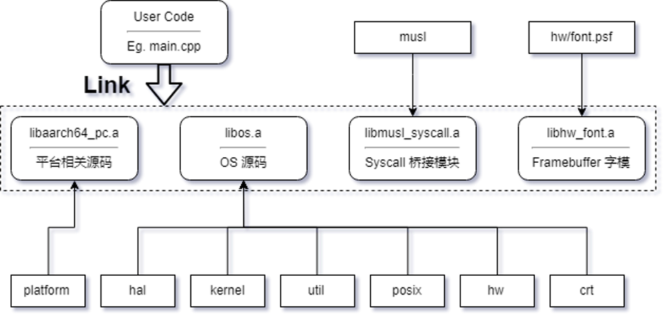

includeOS Runtime Architecture
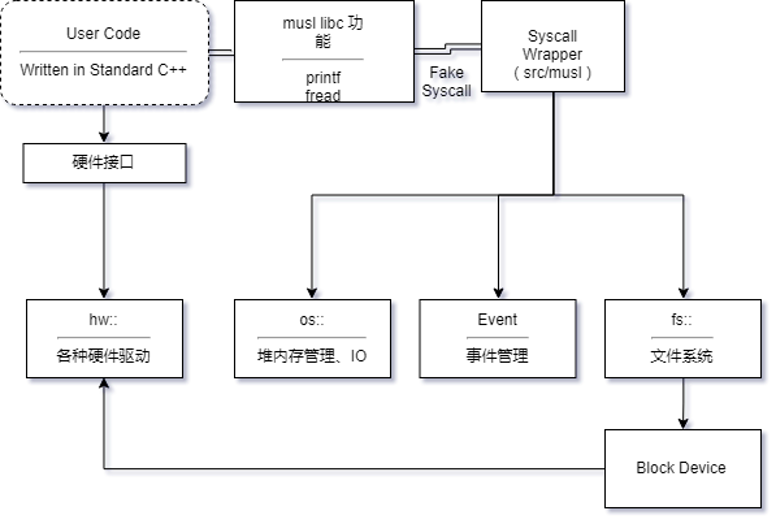


### 现在可以运行的代码一览

ELF Multiboot Bootloader for AArch64 (elf-boot): https://github.com/OSH-2019/x-ridiculous-includeos/tree/master/elf-boot

IncludeOS Library Code: https://github.com/libreliu/includeos

IncludeOS User Code: https://github.com/libreliu/hello_world

### 运行结果

```
[includeos@thinkpad-ssd elf-boot]$ make run
qemu-system-aarch64 -M raspi3 -kernel kernel8.img -serial stdio -drive file=sd.img,format=raw,if=sd
ELF Multiboot Bootloader
DTB Start=837a8, End=882d5, Size=4b2d
Binary Start=882d8, End=e89c40, Size=e01968
Detected Multiboot header at a18e8, magic = 1badb002, flags = 10003, checksum = e4514ffb
[ MOVE ] dest=8000000, src=837a8, size=4b2d
[ MOVE ] ELF_START=80000, _end=e89ce0
md_hdr_offset = 19610 (Hex)
hdr->flags[0] set, 4kb page aligned required
hdr->flags[1] set, avail mem struct required
hdr->flags[2] not set, video mode table not required
hdr->flags[16] set, extra fields valid
header_addr=1019610, load_addr=1000000, load_end_addr=1126c68, bss_end_addr=1126c68, entry_addr=1019600
real_load=882d8, real_load_end=1aef40, real_bss_end=1aef40, real_entry=a18d8
[ MOVE ] dest=1000000, src=882d8, size=126c68
[ MOVE ] ELF_START=80000, _end=e89ce0
move ok.
bss cleared
Magic 3f000000 addrin fffffffd
CurrentEL 00000001
size_cells : 
addr_cells : 
mem_offset : 
RAM BASE : 
RAM SIZE : 
[aarch64 PC] constructor 
[ Machine ] Initializing heap
[ Machine ] Main memory detected as 1055756096 b
[ Machine ] Reserving 1048576 b for machine use 
* Elf start: 0x1000000
* Elf ident: ELF, program headers: 0x1000000
	Elf size: 1207400 
	Phdr 0 @ 0x1000040, va_addr: 0x1000000 
	Phdr 1 @ 0x1000078, va_addr: 0x10e9230 
	Phdr 2 @ 0x10000b0, va_addr: 0x0 
* Initializing aux-vector @ 0xfffe30
* Stack protector value: 0
* Starting libc initialization
<kernel_main> libc initialization complete 
<kernel_main> OS start 
<kernel_main> sanity checks 
<kernel_main> post start 
================================================================================
 IncludeOS 0.15.1-13 (aarch64 / 64-bit)
 +--> Running [ Hello world - OS included ]
~~~~~~~~~~~~~~~~~~~~~~~~~~~~~~~~~~~~~~~~~~~~~~~~~~~~~~~~~~~~~~~~~~~~~~~~~~~~~~~~
 +--> WARNING: No good random source found: RDRAND/RDSEED instructions not available.
[ZTDBG] However, Libre Liu have bypassed this check in kernel, for he couldn't find the correct position to turn it off
~~~~~~~~~~~~~~~~~~~~~~~~~~~~~~~~~~~~~~~~~~~~~~~~~~~~~~~~~~~~~~~~~~~~~~~~~~~~~~~~
[ZTDBG] Calling Service::start()
[ZTDBG] Service::start() with arg=hello
Hello world
This can be both in UART and Framebuffer!
LED on!
LED off!
LED on!
LED off!
LED on!
LED off!
LED on!
LED off!
LED on!
LED off!
LED on!
LED off!
LED on!
LED off!
LED on!
LED off!
LED on!
LED off!
LED on!
LED off!
fs::FAT Constructed
Calling read_sync()
OEM name: 	mkfs.fat
MBR signature: 	0xaa55
Bytes per sector: 	512
Sectors per cluster: 	4
Reserved sectors: 	4
Number of FATs: 	2
Small sectors (FAT16): 	16500
Sectors per FAT: 	20
Sectors per Track: 	32
Number of Heads: 	64
Hidden sectors: 	0
Large sectors: 	0
Disk number: 	0x80
Signature: 	0x29
System ID: 	FAT16   
First data sector: 76
Reserved sectors: 4
Sectors per cluster: 4
Data sectors: 16424
Total clusters: 4106
The image is type FAT16, with 4106 clusters
Root cluster index: 2 (sector 44)
System ID: FAT16   
        [ FAT ] Initializing FAT16 filesystem
                [ofs=0  size=268435456 (0 bytes)]

Initializing Disk...
        [ VFS ] Creating Disk object for emmc1 
        [ VFS ] Mounting std::__1::shared_ptr<fs::Disk> on /emmc1/

================================================================================
                                  Mount points                                  
--------------------------------------------------------------------------------
-- /
   `-- emmc1 (std::__1::shared_...)
________________________________________________________________________________

Calling read_sync()
Long name: osh-test
 +-[ osh-test ]
Calling read_sync()
Short name: .          
Short name: ..         
Long name: hello.txt
   +  .
   +  ..
   +-> hello.txt
     
   
Path: /osh-test/
Calling read_sync()
Long name: osh-test
Calling read_sync()
Short name: .          
Short name: ..         
Long name: hello.txt
Calling read_sync()
Hello world from FAT disk!

       [ main ] returned with status 0
<kernel_main> os_event_loop 
```

Framebuffer 截图：

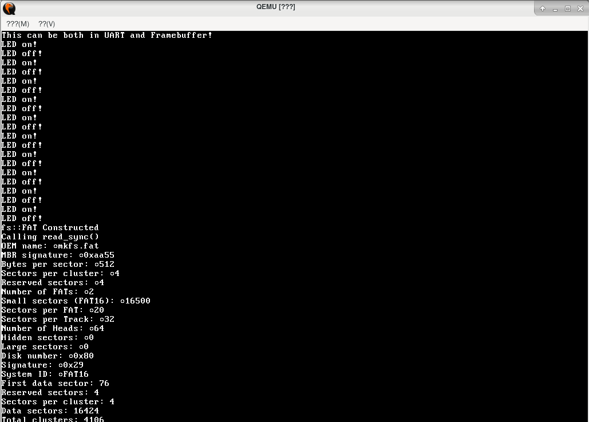

### 构建过程

#### 需要的知识

- ARMv8A Architeture, Exception Level, Registers, Instructions, etc
- How ELF is Executed and Linked
  - See *Linkers and Loaders* for details, also *程序员的自我修养——链接，装载与库*
- How to write Linker Script (for ld) && Usage for objcopy
- CMake & Conan familarity, also C++ new features

#### 环境准备

- Linux / WSL (Tested working)
- 交叉编译器 aarch64-linux-gnu-gcc
- CMake、Make、NASM
- Conan

为了在虚拟机中运行和调试，需要安装如下组件：

- qemu-system-aarch64
- (optional) GdbGui & ObjGui

#### Conan

IncludeOS 自从 0.14 版本开始采用 Conan 进行 Library OS 以及整个 Application 的构建。

Conan 是一个为 C / C++ 程序设计的包管理器——其通过把需要的依赖和库打成包，实现对预编译二进制（.a 等）、构建脚本、IncludePath、包之间的相互依赖的管理。

更详细的介绍请参见 conan.md。

通过 Conan 构建 IncludeOS 大概需要如下步骤：

```shell
# 构建 x86 版本请参见 https://github.com/includeos/includeos
# 下面大致描述构建我们正在移植的 aarch64 版本，更详细可以参见 build.md & conan.md
# 1. 下载 IncludeOS 默认的 config
conan config install https://github.com/includeos/conan_config.git
# 然后，请参见 build.md 对 profile 文件进行适当修改，以配合自己的交叉编译器名称
# 本次用到的 profile 是 gcc-8.2.0-linux-aarch64，建议在 CFLAGS 加上 -g 方便调试
# 其它依赖包请务必通过 -s build_tyoe=Debug 来编译，如果想看调试信息
# 2. Clone Codes
git clone https://github.com/libreliu/hello_world.git
git clone https://github.com/libreliu/includeos.git
# 2.5 （Important!） 将 musl 包加上 -s build_type=Debug 进行编译
# （否则会由于奇怪的编译器优化导致 libc initialization failed）
mkdir musl_manual && cd musl_manual
# 请注意，如果你的 Python 在调用某些包时有 Deprecation warning，请请在 conanfile.py 中先把这些 Warning 去掉
conan get musl/1.1.18@includeos/stable > conanfile.py 
conan create . musl/1.1.18@includeos/stable -pr gcc-8.2.0-linux-aarch64 -s build_type=Debug
cd ..
# 3. Prepare for includeos build (download dependencies)
cd includeos && mkdir build
conan editable add . includeos/$(conan inspect -a version . | cut -d " " -f 2)@includeos/latest --layout=etc/layout.txt
conan install -if build . -pr gcc-8.2.0-linux-aarch64
conan build -bf build .
# （上面这样就构建好了 IncludeOS Library）
cd ../hello_world    # 转到用户目录
source activate.sh
rm CMakeCache.txt    # Make sure previous CMake Configuration Caches are invalidated
cmake . -DCMAKE_LINKER=aarch64-linux-gnu-ld -DCMAKE_OBJCOPY=/usr/bin/aarch64-linux-gnu-objcopy -DCMAKE_BUILD_TYPE=Debug
make
```

作为示例，这里提供一个我使用的快捷构建脚本（如果绑定到桌面的启动器按钮上，就可以一键编译运行了）：

```shell
#!/bin/bash
set -e
source ~/.bashrc

rm /home/includeos/x-ridiculous-includeos/elf-boot/hello.elf.bin || true
cd /home/includeos/includeos
conan build . -bf build
cd ../hello_world
source activate.sh
rm CMakeCache.txt
cmake . -DCMAKE_LINKER=aarch64-linux-gnu-ld -DCMAKE_OBJCOPY=/usr/bin/aarch64-linux-gnu-objcopy -DCMAKE_BUILD_TYPE=Debug
make

cp bin/hello.elf.bin.copy /home/includeos/x-ridiculous-includeos/elf-boot/hello.elf.bin
cd /home/includeos/x-ridiculous-includeos/elf-boot/
make hello.elo
make
make run

read
```

#### `sd.img` 的准备

`sd.img` 是一个 FAT16 的磁盘镜像，可以通过如下方法准备：

```shell
dd if=/dev/zero of=sd.img count=16500  # Minimum for FAT16 (otherwise its formatted as FAT12)
                                       # See build/tools/memdisk/memdisk.py for details on this
mkfs.fat sd.img
sudo mkdir -p /mnt/raspi
sudo mount -o loop sd.img /mnt/raspi
cd /mnt/raspi
mkdir osh-test && cd osh-test
echo "Hello world from FAT disk!\n" > hello.txt
cd / && sudo umount /mnt/raspi 
```

### Boot IncludeOS under AArch64

#### RPi 3b+ 启动

树莓派 3B+ 支持 AArch64（即 ARMv8A）。在这种体系下启动的流程和 OSH Lab1 中 AArch32 的启动流程大致相同，但需要注意几点：

- AArch64 启动时的入口地址是 0x80000，和 AArch32 不同
- AArch64 Flat Binary 的文件名为 kernel8.img，并非 kernel7.img
  - 且当 kernel8.img 和 kernel7.img 同时存在时，树莓派会选择 kernel8.img 进行引导
- AArch64 树莓派启动时的异常级别为 EL2
- 截至目前，没有找到文档描述 AArch64 时树莓派的启动固件会将 fdt 加载到内存的哪个地址，所以本移植的 fdt 加载通过自己的 Bootloader 实现
- 本项目使用的所有 UART 均为 PL011 UART（即树莓派的硬件 UART）
  - 在裸机上，此 UART 默认被用于和蓝牙芯片的通信。为了正确配置，需要在 `config.txt` 中配置 dt-overlay 选项来切换两个串口（PL011 UART & MiniUART）各自的功能，之后才可以在树莓派 GPIO 的 RXD 和 TXD 得到正确的串口信息输出。

#### 内存对齐要求

ARM 平台对内存对齐的要求严格。不同于 x86 和 x86_64，ARM 对非对齐内存的访问一般会触发 Exception （Synchronous Data Abort, Alignment Fault）。

通过 SCTLR 寄存器的控制可以关闭对齐检查，但是对 SIMD 寄存器似乎没有效果。

由于编译器（aarch64-linux-gnu-gcc）会在生成 AArch64 可执行文件时使用 q 系列寄存器，且加上 nosimd 没有效果，所以部分对齐检查仍然会产生显著的影响。

在 Qemu 仿真时，没有加入对 Alignment 的仿真（应该是因为性能原因，毕竟 Quick Emulator），所以在 Qemu 仿真可以运行的代码在真实环境很可能出现问题。由于 util::Lstack 部分的代码还没有经过整理，其中强制类型转换不少，在那里出现的 Alignment Fault 还没有修复完成——也就是裸机暂不可用的原因。

#### ELF Multiboot Bootloader for AArch64

IncludeOS 在运行时，系统组件之一的 musl libc 需要 ELF Program Header 信息初始化 TLS。

为了将 IncludeOS 整个 ELF 加载到内存，本项目自己写了一个简易的，部分支持 Multiboot 规范的 2nd stage Bootloader。（传统上，此项工作由一个裁剪过的 「x86_nano」 平台的 IncludeOS 实现，参见 IncludeOS chainloader）

本项目的 Multiboot 头如下所示：

```c
typedef struct {
    uint32_t magic;
    uint32_t flags;
    uint32_t checksum;
    uint32_t header_addr;
    uint32_t load_addr;
    uint32_t load_end_addr;
    uint32_t bss_end_addr;
    uint32_t entry_addr;
} multiboot_hdr;
```

> 构建的具体过程可以查看 elf-boot 下的 Makefile

这个 Bootloader 通过把 `自己的代码 + 整个 IncludeOS & 用户代码链接好的大 ELF Binary + 整个编译好的 fdt 文件（dtb）` 封装在一个大的 Flat Binary 里，在被树莓派的 Bootloader 整个加载到内存后，按照 ELF Binary 里 Multiboot Header 的请求将 ELF 加载到合适的位置，将其 BSS 段清零，并将 dtb 文件加载到 0x8000000 处（可以通过修改 main.c 中的常量更改）。

需要注意以下细节：

- Multiboot Header 必须为四字节对齐，且位于前 3.125M 范围内
  - 这里和原来的 Specification 略有不同——因为加上调试选项的 ELF Binary 体积剧烈增加，Program Header 啥的把 8K 都占掉了，索性改大一点
- make 前要手动把 hello.elf.bin 和 bcm2837-rpi-3-b-plus.dtb 拷到 elf-boot 文件夹下
- 用 make run 可以测试镜像是否成功运行
- 前面为了调试方便，有设置 mem_rand() 函数（但是注释掉了），可以视情况决定是否开启
  - 是因为 Qemu 的内存默认都初始化成 0，可能掩盖了一些引用未初始化变量的错误，所以设置此函数

### 调试 IncludeOS under AArch64

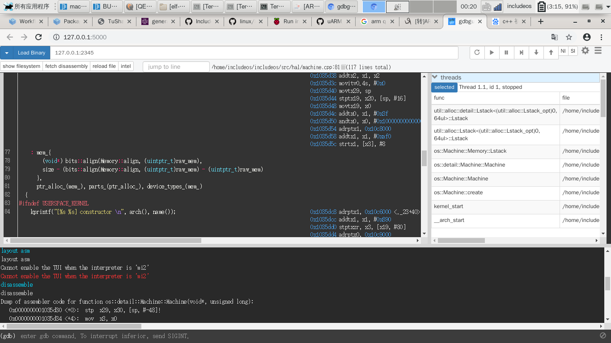


通过 Qemu 进行调试。 Qemu 支持远程调试功能，可以和 gdb 配合进行系统内代码的调试。

使用 Qemu 的命令行：`qemu-system-aarch64 -M raspi3 -kernel kernel8.img -S -gdb tcp::2345 -
drive file=sd.img,format=raw,if=sd`。

在调试时需要注意以下几点：

- QEMU 不检查内存对齐（包括对 SIMD 寄存器的访问），而 ARMv8a 检查，且 ARMv8a 的 SCTLR 只能关掉对常规寄存器的检查（前面已经说明）

- 利用 -S 让没有连接好 gdb 前先停住

  - 如果在某个时刻单步突然不起作用，应该就是跑到了不应该跑到的地址
  - 这个时候 gdb 会卡死，原因是 Qemu 正在模拟——所以需要到 Qemu 处「暂停（模拟）」，gdb 才会有反应

利用 GdbGui 调试：`gdbgui -g aarch64-linux-gnu-gdb`

- 进入后连接 gdbserver：`target remote localhost:2345`
- 加载符号信息（看你要调试哪一个程序，Bootloader 还是 IncludeOS Library & User Code）：
  - file hello.elf.bin
  - add-symbol-file kernel8.elf 0x80000
    - 这里 0x80000 是为了指定 .text 段被加载到的位置

查看 ELF & 反编译：ObjGUI（一个 objdump 的前端）

同时请注意，调试时可以显示源码和汇编的对应关系需要如下条件：
- 在编译的时候开启 –g
- DWARF 节在链接和 ELF 装入内存的时候没有丢失
  - 显然，ELF 必须按照 Program Header 指定的地址装入内存，否则也显示不出来（或者都是乱的）
  - 用 `ld --verbose` 查看默认链接脚本，其中有对 DWARF 的处理行为（即原样保留）
- 源代码的系统路径没有改变

### 驱动支持

#### GPIO

GPIO 驱动本质上是对特定内存读写任务的封装。\
接口封装了如下 API：

``` C
/* Read 32 bit value from a peripheral address. */
__uint32_t read_peri(volatile __uint32_t *paddr);
namespace hw
{
	class GPIO
	{
		public:
			/* Read 32 bit value from a peripheral address. */
			__uint32_t read_peri(volatile __uint32_t *paddr);

			/*  Write 32 bit value to a peripheral address. */ 
			void write_peri(volatile __uint32_t *paddr, __uint32_t value);

			/* Set bits in the address. */
			void gpio_set_bits(volatile __uint32_t *paddr, __uint32_t mask, __uint32_t value);

			/* Select the function of GPIO. */
			void gpio_func_select(const __uint8_t pin, __uint8_t mode);

			/* Set output pin. */
			void gpio_set(const __uint8_t pin);

			/* Clear output pin. */
			void gpio_clr(const __uint8_t pin);

			/* Read the current level of input pin. */
			int gpio_read_level(const __uint8_t pin);

			/* Get the time. */
			__uint32_t gpio_timer(void);
			
			/* Delay count. Return 0 if overflow, return 1 if success. */
			int gpio_delay(int count);
	};
};
```

API 封装在 `hw` 命名空间下。\
利用提供的 API 可以轻松对 GPIO 端口进行读写操作。

#### UART

实现 UART 驱动需要用到 Mailbox 通信。

##### Mailbox

Mailbox 是 CPU 与 VideoCore 通信的工具，VideoCore 是 Broadcom 开发的非传统意义的 GPU。树莓派的启动就是由 VideoCore 负责的，它还负责管理外设。所以要实现 UART 驱动，需要通过 Mailbox 与 VideoCore 通信。

Mailbox 有以下几个可用的channels，不同的channel，消息格式不同

- 0: Power management
- 1: Framebuffer
- 2: Virtual UART
- 3: VCHIQ
- 4: LEDs
- 5: Buttons
- 6: Touch screen
- 7:
- 8: Property tags (ARM -> VC)
- 9: Property tags (VC -> ARM)

本次实现中主要使用 channel 8.

Channel 8 的消息格式如下：
```text
       0       4       8      12      16      20      24      28      32
       +---------------------------------------------------------------+
0x00   |                         Buffer Size(消息缓冲区长度)            |
       +---------------------------------------------------------------+
0x04   | Request(0)/Response                                           |
       |	(0x80000000 for success, 0x80000001 for an error) Code |
       +---------------------------------------------------------------+
0x08   |                             Tags(具体命令)                     |
...    \\                                                             \\
0xXX   |                             Tags                              |
       +---------------------------------------------------------------+
0xXX+4 |                           End Tag (0，表示消息结束)            |
       +---------------------------------------------------------------+
0xXX+8 |                           Padding                             |
...    \\                                                             \\
0xXX+16|                           Padding                             |
       +---------------------------------------------------------------+
```

其中 Tag 的格式如下：

```text
       0       4       8      12      16      20      24      28      32
       +---------------------------------------------------------------+
0x00   |                         Tag Identity                          |
       +---------------------------------------------------------------+
0x04   |                       Value Buffer Size                       |
       +---------------------------------------------------------------+
0x08   |                     Request/Response Code                     |
       +---------------------------------------------------------------+
0x0C   |                          Value Buffer                         |
...    \\                                                             \\
0xXX   | Value Buffer  |                    Padding                    |
       +---------------------------------------------------------------+
```

  - Tag Identity 一般格式为0x000XYZZZ，X 表示要传递消息的硬件设备, Y 表示命令的类别(0 if get, 4 = test, 8 if set) and ZZZ 描述具体的命令；

  - Value Buffer Size 为 Tag 的缓冲区长度；

  - Request(0)/Response(0x80000000+length of results) Code;

  - Value Buffer 存储请求的具体参数或者相应的结果。

UART 的发送和接收引脚分别位于 GPIO 14 和 GPIO 15.\
为了完成 UART 驱动支持，需要：

- 使用 Mailbox 和 VideoCore 通信设置时钟频率；

- 设置 GPIO 14 和 GPIO 15 的 function 为 alt0；

- 设置 pull-up/down resistor（使信号更加稳定，减少外界信号干扰）；

- 设置 UART 传输参数（波特率、校验位等）。

最终提供了如下接口：
```C
/* Init UART. */
void uart_init();

/* Send to UART. */
void uart_send(unsigned int c);

/* Get from UART. */
char uart_getc();

/* Send a string to UART. */
void uart_puts(char *s);
```

#### Framebuffer(Support for Screen Device)

Framebuffer 是 Linux 系统抽象给用户读写显示设备的接口。它把消除了显示设备的底层硬件差异，将底层抽象为一块缓冲区，使得上层应用可以直接对缓冲区进行读写即可完成对屏幕的读写。

驱动的编写过程有些部分可以参考使用 Verilog 编写 VGA 驱动的过程。

这里需要使用字模文件，这里使用 Linux Console 字体文件作为字模。

提供了如下 API：

```C
/* Initialize framebuffer. */
int screen_init();

/* Print string on the screen */
void screen_print(const char *s);

```

- `screen_init`初始化`screen device`。它设定通过 Mailbox 设定屏幕分辨率等信息，初始化起始打印位置（默认 (0,0) ），并且获得 framebuffer 的起始地址；

- `screen_print`函数会根据字模在屏幕上打印字符串，即向对应的 framebuffer 里存放数据。

API 封装在 `hw` 目录下。

#### eMMC & SD Card

Raspberry Pi 3b+ 

Raspberry Pi 3b+ 使用 MMIO 和 Interrupt 完成对 eMMC 设备的控制，所用到的 MMIO 地址如下（具体参考 Broadcom 的文档 [BCM2835-ARM-Peripherals.pdf](https://www.raspberrypi.org/app/uploads/2012/02/BCM2835-ARM-Peripherals.pdf)）：

```c
#define EMMC_ARG2 ((volatile unsigned int *)(MMIO_BASE + 0x00300000))
#define EMMC_BLKSIZECNT ((volatile unsigned int *)(MMIO_BASE + 0x00300004))  // block size
#define EMMC_ARG1 ((volatile unsigned int *)(MMIO_BASE + 0x00300008))  // cmd arg
#define EMMC_CMDTM ((volatile unsigned int *)(MMIO_BASE + 0x0030000C))  // cmd
#define EMMC_RESP0 ((volatile unsigned int *)(MMIO_BASE + 0x00300010))
#define EMMC_RESP1 ((volatile unsigned int *)(MMIO_BASE + 0x00300014))
#define EMMC_RESP2 ((volatile unsigned int *)(MMIO_BASE + 0x00300018))
#define EMMC_RESP3 ((volatile unsigned int *)(MMIO_BASE + 0x0030001C))
#define EMMC_DATA ((volatile unsigned int *)(MMIO_BASE + 0x00300020))
#define EMMC_STATUS ((volatile unsigned int *)(MMIO_BASE + 0x00300024))  // status
#define EMMC_CONTROL0 ((volatile unsigned int *)(MMIO_BASE + 0x00300028))
#define EMMC_CONTROL1 ((volatile unsigned int *)(MMIO_BASE + 0x0030002C))
#define EMMC_INTERRUPT ((volatile unsigned int *)(MMIO_BASE + 0x00300030))  // interrupt
#define EMMC_INT_MASK ((volatile unsigned int *)(MMIO_BASE + 0x00300034))  // interrupt enable
#define EMMC_INT_EN ((volatile unsigned int *)(MMIO_BASE + 0x00300038))  // interrupt mask
#define EMMC_CONTROL2 ((volatile unsigned int *)(MMIO_BASE + 0x0030003C))
#define EMMC_SLOTISR_VER ((volatile unsigned int *)(MMIO_BASE + 0x003000FC))
```

EMMC 模块给外部操作提供的接口有：

```c
/**
 * init sd card
 */
int sd_init();

/**
 * read blocks
 * lba  起始 block address
 * num  读取的 block 数
 */
int sd_readblock(unsigned int lba, unsigned char *buffer, unsigned int num);

/**
 * write block
 * lba  起始 block address
 * num  写入的 block 数
 */
int sd_writeblock(unsigned char *buffer, unsigned int lba, unsigned int num);
```

内部实现的所有函数有：

```c
/**
 * Wait for data or command ready
 */
int sd_status(unsigned int mask);

/**
 * Wait for interrupt
 */
int sd_int(unsigned int mask);

/**
 * Send a command
 */
int sd_cmd(unsigned int code, unsigned int arg);

/**
 * read a block from sd card and return the number of bytes read
 * returns 0 on error.
 */
int sd_readblock(unsigned int lba, unsigned char *buffer, unsigned int num);

/**
 * write a block to the sd card and return the number of bytes written
 * returns 0 on error.
 */
int sd_writeblock(unsigned char *buffer, unsigned int lba, unsigned int num);

/**
 * set SD clock to frequency in Hz
 */
int sd_clk(unsigned int f);

/**
 * initialize EMMC to read SDHC card
 */
int sd_init();
```

每一个对 SD Card 的操作都可以分为如下几步：

1. 等待 SD 到指定状态（data or command ready），通过 `sd_status` 函数完成。

2. 发送指定的命令，通过 `sd_cmd` 完成。此时通过 `EMMC_CMDTM` 和 `EMMC_ARG1` 两个 MMIO 地址完成命令和参数的传递。

3. 等待命令完成（`sd_cmd` 函数，通过检测 `EMMC_INTERRUPT`）。可以通过中断方式处理，也可以通过轮询 `EMMC_INTERRUPT` 这个 MMIO 地址的数据。受限于中断系统的进度，暂用轮询的方式处理。

4. 读取返回的数据

`sd_readblock` 和 `sd_writeblock` 都是上述步骤完成的功能。

常用的几个操作命令代码如下（具体参考 Broadcom 的文档 [BCM2835-ARM-Peripherals.pdf](https://www.raspberrypi.org/app/uploads/2012/02/BCM2835-ARM-Peripherals.pdf)）：

```c
// COMMANDs
#define CMD_GO_IDLE 0x00000000
#define CMD_ALL_SEND_CID 0x02010000
#define CMD_SEND_REL_ADDR 0x03020000
#define CMD_CARD_SELECT 0x07030000
#define CMD_SEND_IF_COND 0x08020000
#define CMD_STOP_TRANS 0x0C030000
#define CMD_READ_SINGLE 0x11220010
#define CMD_READ_MULTI 0x12220032
#define CMD_SET_BLOCKCNT 0x17020000
#define CMD_WRITE_SINGLE 0x18220010
#define CMD_WRITE_MULTI 0x19220032
#define CMD_APP_CMD 0x37000000
#define CMD_SET_BUS_WIDTH 0x06020000
#define CMD_SEND_OP_COND 0x06020000
#define CMD_SEND_SCR 0x33220010
```

此处略去上述所有函数的具体实现，具体可参考实现代码。

IncludeOS 中 SD Card 抽象为 `Writable Block Device`, 并有一个抽象类 `Writable_Block_device` 对应，继承实现这个抽象类，IncludeOS 就有了通过通用接口 `open`, `read`, `write` 操作 SD Card 的能力（具体需要用到 VFS, 见后续内容）。

```c++
#include <hw/writable_blkdev.hpp>

namespace hw
{
    class Rpi_Emmc : public Writable_Block_device
    {
    public:
        ~Rpi_Emmc();

        std::string device_name() const override;

        const char *driver_name() const noexcept;

        block_t size() const noexcept;

        block_t block_size() const noexcept;

        void read(block_t blk, on_read_func reader);

        void read(block_t blk, size_t count, on_read_func reader);

        buffer_t read_sync(block_t blk, size_t count = 1);

        void write(block_t blk, buffer_t, on_write_func);

        bool write_sync(block_t blk, buffer_t);

        void deactivate() override;

    protected:
        Rpi_Emmc() noexcept;

    private:
        int id_;
    }
}
```


#### MMU

AArch64 体系结构的 MMU 由如下几个 System Register 控制（具体参考 [AArch64 Reference](https://developer.arm.com/docs/ddi0487/latest/arm-architecture-reference-manual-armv8-for-armv8-a-architecture-profile)）：

- `TCR`: Translation Control Register, 控制页表转换过程的一些属性，如 cacheability, shareability.

- `MAIR`: Memory Attribute Indirection Registers, 设置页表项中不同 AttrIndx 值得具体语义（见页表项的具体划分）。

- `SCTLR`: System Control Register, 控制页表、缓存等的启用与否。

- `TTBR0/1`: Translation Table Base Register, 保存页表的起始地址（`TTBR0` 为 user space, `TTBR1` 为 kernel space）。

一般的操作系统会使用 `kernel space` 和 `user space` 两个不同的地址空间以隔离内核程序和数据，保证安全性。AArch64 也提供了相应的支持：`TTBR0` 保存 user space 的页表，`TTBR1` 保存 kernel space 的页表。

AArch64 的页表可以配置为 2, 3, 4 级，页大小也可以配置为 4KB, 16KB, 64KB. 为方便起见，此处仅讨论 3 级 4KB 页大小的页表配置（这也是 Linux on AArch64 的常用配置）。这种配置下，地址空间划分如下：

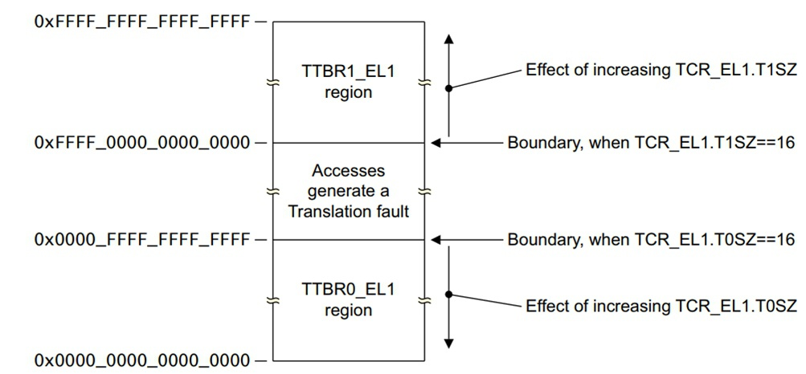

| Start              | End                | Size           | Use    |
|--------------------|--------------------|----------------|--------|
| 0x0000000000000000 | 0x0000007fffffffff | 512GB (39-bit) | user   |
| 0xffffff8000000000 | 0xffffffffffffffff | 512GB (39-bit) | kernel |

在 IncludeOS 中，由于不区分系统程序和用户程序，整个项目是**单地址空间**的（我们选择 user space）。单地址空间可以减小页表的维护开销，对于降低响应时间有一定帮助。

我们仅需配置 `TTBR0` 即可。

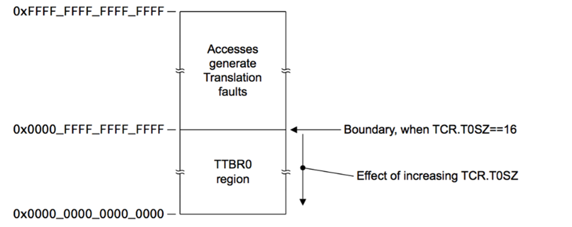

对于页大小为 4KB 的三级页表，一个逻辑地址的组成如下：

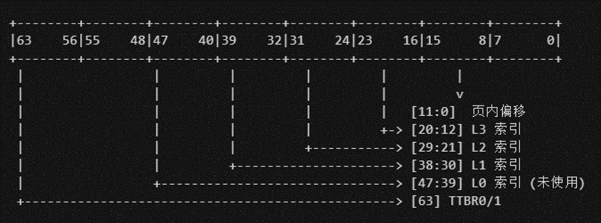

页表的翻译过程如下：

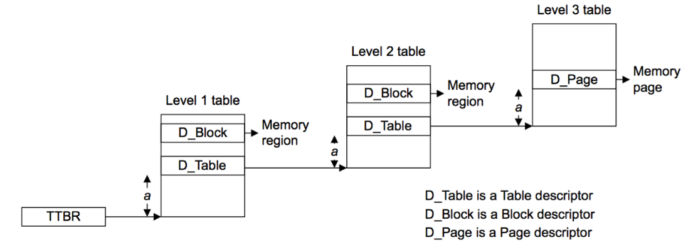

上图中的 `a` 就是逻辑地址中的 L1 ~ L3 索引，`Block` 代表地址翻译没有到 3 级就结束，`Table` 代表继续查找下一级页表翻译，最后找到 `Page`, 找到物理地址。

页表项的组成如下：

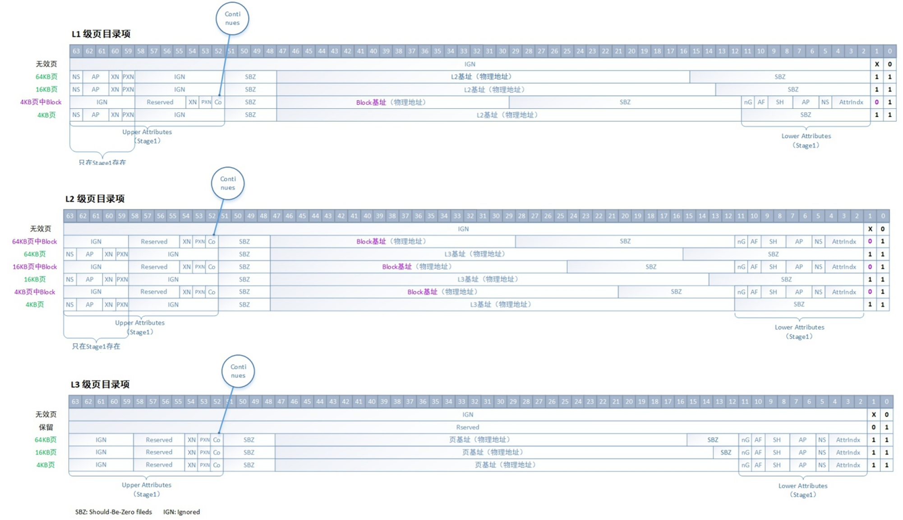

本项目中配置了一个覆盖 1G 逻辑地址空间(`0x00000000` ~ `0x3FFFFFFF`) 的 3 级页表，为方便起见，把覆盖的逻辑地址变换为相同的物理地址。

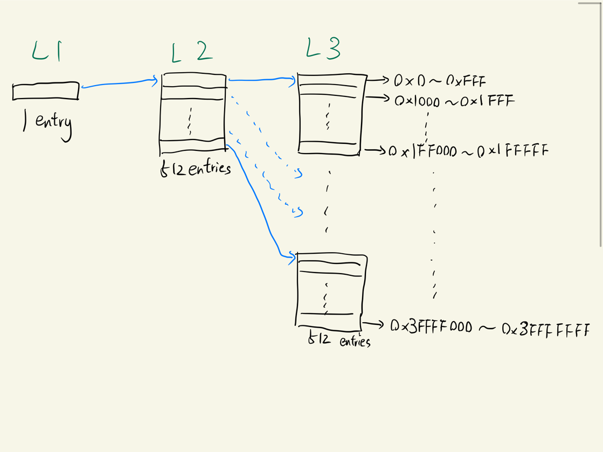

页表项有一些属性设置，如下：

```c
// granularity
#define PT_PAGE 0b11  // 4k granule
#define PT_BLOCK 0b01 // 2M granule
// accessibility
#define PT_KERNEL (0 << 6) // privileged, supervisor EL1 access only
#define PT_USER (1 << 6)   // unprivileged, EL0 access allowed
#define PT_RW (0 << 7)     // read-write
#define PT_RO (1 << 7)     // read-only
#define PT_AF (1 << 10)    // accessed flag
#define PT_NX (1UL << 54)  // no execute
// shareability
#define PT_OSH (2 << 8) // outter shareable
#define PT_ISH (3 << 8) // inner shareable
// defined in MAIR register
#define PT_MEM (0 << 2) // normal memory
#define PT_DEV (1 << 2) // device MMIO
#define PT_NC (2 << 2)  // non-cachable
```

各级页表的配置代码如下：

##### L1

```c
page_base[0 * page_entries + 0] = (page_addr + 1 * PAGESIZE) | // L2 physical address
                                    PT_PAGE |                  // set as table desc
                                    PT_AF |                    // accessed flag
                                    PT_USER |                  // non-privileged
                                    PT_ISH |                   // inner shareable
                                    PT_MEM;                    // normal memory
```

##### L2

```c
// 512 个 L2 条目
for (uint64_t i = 0; i < page_entries; i++)
{
    page_base[1 * page_entries + i] = (page_addr + (2 + i) * PAGESIZE) | // L3 physical address
                                        PT_PAGE |                        // set as table desc
                                        PT_AF |                          // accessed flag
                                        PT_USER |                        // non-privileged
                                        PT_ISH |                         // inner shareable
                                        PT_MEM;                          // normal memory
```

##### L3

```c
// 每个 L2 对应 512 个 L3
for (uint64_t j = 0; j < page_entries; j++)
{
    uint64_t page_index = i * page_entries + j;
    uint64_t entry = (page_index * PAGESIZE) | // physical address
                        PT_PAGE |              // set as page desc
                        PT_AF |                // accessed flag
                        PT_USER;               // non-privileged
    // 可执行部分设置为 read-only
    if ((page_index >= text_start_page) && (page_index < exec_end_page))
    {
        entry |= (PT_RO | PT_ISH | PT_MEM);
    }
    // ro-data 部分设置为 read-only, no-execute
    else if ((page_index >= ro_start_page) && (page_index < ro_end_page))
    {
        entry |= (PT_RO | PT_NX | PT_ISH | PT_MEM);
    }
    // mmio 部分必须设置为为 outter shared, 以保证 CPU 和外设读取数据的一致性
    else if (page_index >= mmio_start_page)
    {
        entry |= (PT_NX | PT_RW | PT_OSH | PT_DEV);
    }
    // 其他 read-write, no-execute
    else
    {
        entry |= (PT_NX | PT_RW | PT_ISH | PT_MEM);
    }
    page_base[2 * page_entries + page_index] = entry;
}
```

可以看到整个地址空间被划分成了四部分：

- `text` 部分，是可执行的机器码，为防止被恶意修改，应该设置为 `read-only`, 对于静态编译的 IncludeOS, 这部分一经设定后就不会再更改，有效防止设备遭受恶意攻击导致的程序遭到恶意修改。

- `ro-data` 部分，设置为 `read-only`

- `MMIO` 部分，设置为 `outter shared`, 以保证 CPU 对 MMIO 数据的修改都能及时被外设读取到（`outter shared` 部分不使用 cache）

- 除 `text` 以外的部分都设置成 `no-execute`, 防止程序执行了意想不到的代码

由于 Raspberry Pi 3b+ 有 1GB 的内存，对于一般 IoT 任务都绰绰有余，因此暂时没有处理 `Page Fault`, 页换入换出等功能，也没有实现虚拟内存。

经过以上配置，IncludeOS 具有一个 AArch64 Raspberry Pi 3b+ 下的静态页表。


#### Exception

AArch64 中的 Exception 可以分为以下部分：

- Interrupt
  - IRQ （普通中断）
  - FIQ （快速中断，更高的处理优先级，Linux 中未涉及）
  - Serror (System Error)
- Aborts
  - synchronous：Instruction/Data Abort，Page Fault
  - asynchronous：外部硬件故障
- Reset
- System Call
  - Supervisor Call (SVC) ：User Program 向 Kernel 申请服务
  - Hypervisor Call (HVC) ：Guest OS 向 Hypervisor 申请服务
  - Secure monitor Call (SMC) ：切换进入 Secure Mode

Exception 控制系统用到如下的 System Register:

- VBAR (Vector Base Address Register) ：异常向量表基地址

- ESR (Exception Syndrome Register) ：记录异常类型、原因

- ELR (Exception Linker Register) ：发生异常的 PC

- SPSR (Saved Program Status Register) ：发生异常时的 Program Status Register

- FAR (Fault Address Register) ：记录产生 Data Abort 异常的访存地址

发生异常后，CPU 会记录 `ESR`, `ELR`, `SPSR`, `FAR` 等，并在 `VBAR` 处查找异常处理向量表，并根据异常类型跳转到 VBAR 的特定偏移位置处理异常。

异常处理向量表结构如下：

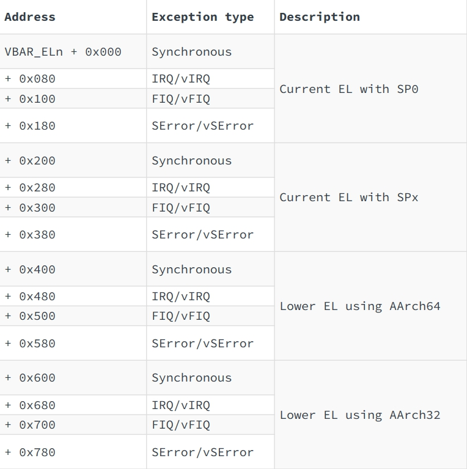

实现的 ARM 汇编码如下：

```arm
.align 11
_vectors:

// synchronous
.align 7
mov x0, #0
mrs x1, esr_el1
mrs x2, elr_el1
mrs x3, spsr_el1
mrs x4, far_el1
b exc_handler

// IRQ
.align 7
mov x0, #1
mrs x1, esr_el1
mrs x2, elr_el1
mrs x3, spsr_el1
mrs x4, far_el1
b exc_handler

// FIQ
.align 7
mov x0, #2
mrs x1, esr_el1
mrs x2, elr_el1
mrs x3, spsr_el1
mrs x4, far_el1
b exc_handler

// SError
.align 7
mov x0, #3
mrs x1, esr_el1
mrs x2, elr_el1
mrs x3, spsr_el1
mrs x4, far_el1
b exc_handler
```

为了便于调试，我们针对部分同步异常做了异常处理（输出异常信息），异常处理函数如下：

```c
void exc_handler(unsigned long type, unsigned long esr, unsigned long elr, unsigned long spsr, unsigned long far)
{
    // print out interruption type
    switch(type) {
        case 0: uart_puts("Synchronous"); break;
        case 1: uart_puts("IRQ"); break;
        case 2: uart_puts("FIQ"); break;
        case 3: uart_puts("SError"); break;
    }
    uart_puts(": ");
    // decode exception type
    switch(esr>>26) {
        case 0b000000: uart_puts("Unknown"); break;
        case 0b000001: uart_puts("Trapped WFI/WFE"); break;
        case 0b001110: uart_puts("Illegal execution"); break;
        case 0b010101: uart_puts("System call"); break;
        case 0b100000: uart_puts("Instruction abort, lower EL"); break;
        case 0b100001: uart_puts("Instruction abort, same EL"); break;
        case 0b100010: uart_puts("Instruction alignment fault"); break;
        case 0b100100: uart_puts("Data abort, lower EL"); break;
        case 0b100101: uart_puts("Data abort, same EL"); break;
        case 0b100110: uart_puts("Stack alignment fault"); break;
        case 0b101100: uart_puts("Floating point"); break;
        default: uart_puts("Unknown"); break;
    }
    // decode data abort cause
    if(esr>>26==0b100100 || esr>>26==0b100101) {
        uart_puts(", ");
        switch((esr>>2)&0x3) {
            case 0: uart_puts("Address size fault"); break;
            case 1: uart_puts("Translation fault"); break;
            case 2: uart_puts("Access flag fault"); break;
            case 3: uart_puts("Permission fault"); break;
        }
        switch(esr&0x3) {
            case 0: uart_puts(" at level 0"); break;
            case 1: uart_puts(" at level 1"); break;
            case 2: uart_puts(" at level 2"); break;
            case 3: uart_puts(" at level 3"); break;
        }
    }
    // dump registers
    uart_puts(":\n  ESR_EL1 ");
    uart_hex(esr>>32);
    uart_hex(esr);
    uart_puts(" ELR_EL1 ");
    uart_hex(elr>>32);
    uart_hex(elr);
    uart_puts("\n SPSR_EL1 ");
    uart_hex(spsr>>32);
    uart_hex(spsr);
    uart_puts(" FAR_EL1 ");
    uart_hex(far>>32);
    uart_hex(far);
    uart_puts("\n");
    // no return
    while(1);
}
```

以此便可以快速定位开发过程中出现的问题类型。

#### USB

Raspberry Pi 3b+ 的网卡挂载在 USB 2.0 总线上，因此完成 USB 系统的适配才能有网络连接。由于 USB 系统比较复杂，此项工作仍处于起步阶段，目前主要以参考 Raspberry Pi 3b+ bare metal 代码为主。


#### File system
File system 主要分为两个部分：一个是实文件系统，这里用的是 FAT；一个是虚文件系统。

##### FAT

有三个重要的基类：分别为 Block_Device 类， File_system 类，Disk类。

其中， Block_Device 类为所有可读硬件类的抽象基类，提供基本的借口。 Block_Device 类将构造函数设为私有，并设有计数器，用以计数有多少 Block_Device 类被实例化。当需要实例化一个继承自 Block_Device 类的实类时，一般会自己再构造一个 get() 函数。比如在 memdisk 类中

```c++
static Memdisk& get() noexcept {
    static Memdisk memdisk;
    return memdisk;
}
```

用这种方法，可以很好地保证类的实列为单例，这符合实际应用需求。

File_system 类为所有文件系统类的抽象基类，在这里，FAT 类就继承自 File_system 类。File_system 有一个内部成员为 Block_Device 类的指针，并且在实例化一个 File_system 类时，必须传入一个继承自 Block_Device 类的实例。

Disk 类是对 File_system 类和 Block_Device 类的进一步抽象。Disk 类在实例化时，传入一个 Block_Device 类的实例，再通过 init_fs() 函数进行文件系统的初始化。但 Disk 类本身不提供读写接口，这么做是为了下面的 VFS。

##### VFS

VFS 是一个类，他的节点是 VFS_entry 类。用的数据结构为最一般的树形结构。

VFS_entry 通过成员`void *obj_`保证了任何数据类型都可以成为 VFS 的内部可挂载对象。

VFS 主要负责维护文件路径，以及上述 Disk 的挂载。当挂载好东西后，就可以通过绝对路径或相对路径访问一个文件并对其进行读写。VFS 同时还支持直接返回一个描述文件夹的类 Dirent 方便进行迭代，也支持直接返回一个文件描述符 fd。

fd 在这里被实现为一个类，但这个类对外隐藏，外部通过被实现为 int 的文件描述符进行工作，这一点设计的和 Linux 类似。fd 通过 fd_compatible 类进行管理。fd_compatible 本质上就是一个 `std:map`。


## 未来展望

- 未来希望能够在裸机上成功启动，以便进一步对各驱动的完成情况进行检验；

- 希望能够成功添加 USB 驱动，因为 USB 驱动是 Ethernet 驱动的基础和前提；

- 希望能够提供 Ethernet 支持；

- 希望能够完善 FAT 文件系统中的 FAT 表维护，并提供写支持；

- 希望能够完成 includeOS 和传统操作系统网络性能对比；

- 如果有可能的话，Merge 进 includeOS 的官方 AArch64 的工作，为开源社区作出贡献。

## 参考文献

1. [Alfred Bratterud, Alf-Andre Walla, Harek Haugerud, Paal E. Engelstad, Kyrre Begnum,"IncludeOS: A minimal, resource efficient
unikernel for cloud services"](https://github.com/includeos/IncludeOS/blob/master/doc/papers/IncludeOS_IEEE_CloudCom2015_PREPRINT.pdf)
2. [Rasberry pi Mailbox prop-channel.](https://jsandler18.github.io/extra/prop-channel.html)
3. [Arm® Architecture Reference Manual Armv8, for Armv8-A architecture profile](https://developer.arm.com/docs/ddi0487/latest/arm-architecture-reference-manual-armv8-for-armv8-a-architecture-profile)
4. [Bare metal Raspberry Pi 3 tutorials](https://github.com/bztsrc/raspi3-tutorial)
5. Documentations from [Conan](https://docs.conan.io/), [CMake](https://cmake.org/documentation/), and other stuff (ld, IncludeOS, gcc, nasm, gas, qemu...)