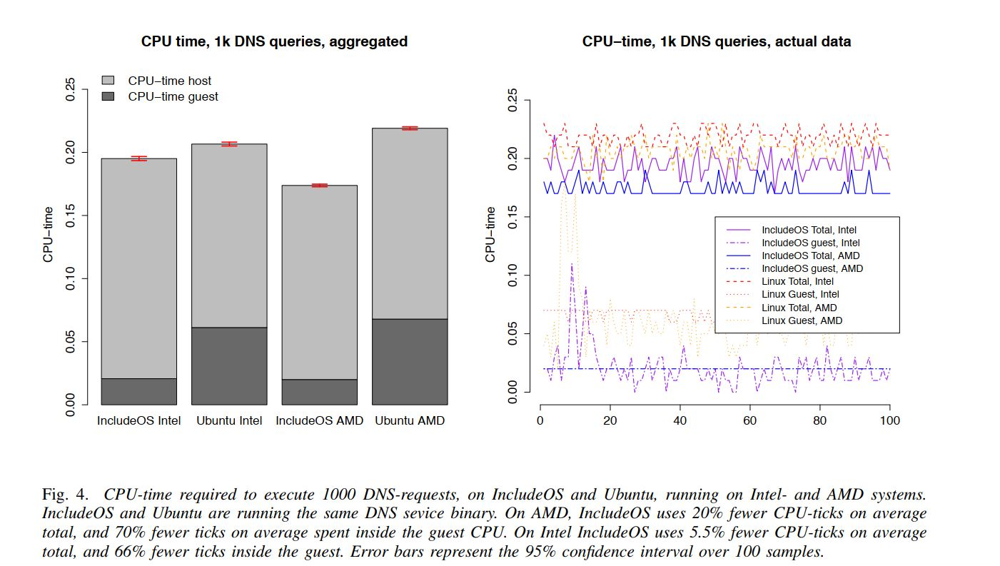
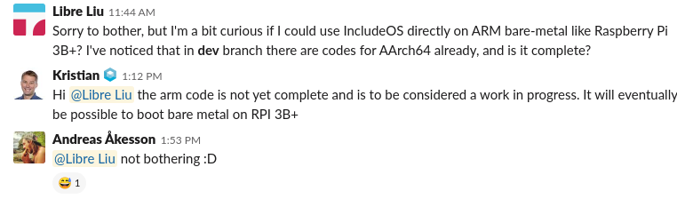

# includeOS on ARM 可行性报告
- [includeOS on ARM 可行性报告](#includeos-on-arm-%E5%8F%AF%E8%A1%8C%E6%80%A7%E6%8A%A5%E5%91%8A)
  - [项目介绍](#%E9%A1%B9%E7%9B%AE%E4%BB%8B%E7%BB%8D)
  - [理论依据](#%E7%90%86%E8%AE%BA%E4%BE%9D%E6%8D%AE)
    - [A. 实验准备](#a-%E5%AE%9E%E9%AA%8C%E5%87%86%E5%A4%87)
    - [B. 实验结果](#b-%E5%AE%9E%E9%AA%8C%E7%BB%93%E6%9E%9C)
    - [C. 通过实验的局限](#c-%E9%80%9A%E8%BF%87%E5%AE%9E%E9%AA%8C%E7%9A%84%E5%B1%80%E9%99%90)
  - [技术依据](#%E6%8A%80%E6%9C%AF%E4%BE%9D%E6%8D%AE)
    - [includeOS 环境配置](#includeos-%E7%8E%AF%E5%A2%83%E9%85%8D%E7%BD%AE)
    - [includeOS Demo](#includeos-demo)
    - [includeOS 构建过程](#includeos-%E6%9E%84%E5%BB%BA%E8%BF%87%E7%A8%8B)
    - [includeOS 启动过程（x86）](#includeos-%E5%90%AF%E5%8A%A8%E8%BF%87%E7%A8%8Bx86)
    - [includeOS Digest on Startup](#includeos-digest-on-startup)
      - [`_start` @ `src/platform/x86_pc/start.asm`](#start--srcplatformx86pcstartasm)
      - [`__arch_start` @ `src/arch/x86_64/arch_start.asm`](#archstart--srcarchx8664archstartasm)
      - [`kernel_start` @ `src\platform\x86_pc\kernel_start.cpp`](#kernelstart--srcplatformx86pckernelstartcpp)
      - [`kernel_main` @ `src\platform\x86_pc\kernel_start.cpp`](#kernelmain--srcplatformx86pckernelstartcpp)
    - [includeOS 源码阅读](#includeos-%E6%BA%90%E7%A0%81%E9%98%85%E8%AF%BB)
  - [技术路线](#%E6%8A%80%E6%9C%AF%E8%B7%AF%E7%BA%BF)
    - [需要进行的工作](#%E9%9C%80%E8%A6%81%E8%BF%9B%E8%A1%8C%E7%9A%84%E5%B7%A5%E4%BD%9C)
    - [Coding Styles](#coding-styles)
    - [需要熟悉的工具链/领域](#%E9%9C%80%E8%A6%81%E7%86%9F%E6%82%89%E7%9A%84%E5%B7%A5%E5%85%B7%E9%93%BE%E9%A2%86%E5%9F%9F)
  - [参考文献](#%E5%8F%82%E8%80%83%E6%96%87%E7%8C%AE)

## 项目介绍

IncludeOS 是一个 C++ 的 Unikernel 实现，并可以在 bare-metal 上运行。IncludeOS 提供了丰富的用于网络编程的库，但是目前还不支持在 ARM 上运行。裸机运行的 IncludeOS 相较于 Linux 发行版拥有更快的启动速度，并且减少了进程切换等的无谓开销。现有的树莓派的 Unikernel 主要是对一些开关 GPIO 等相关的实现，但是对网络的支持很弱。在 IoT 领域中，有许多应用场景对延迟的要求十分苛刻，而本项目意在将 IncludeOS 移植到 ARM 上，这样对延迟敏感的 IoT 应用场景会有很大帮助。

## 理论依据

我们选择 includeOS 的一个重要原因是它具有更好的网络性能并且占用更少的资源。下面的实验（见**参考文献2**）展示了 IncludeOS 相比于传统方式的优势。实验的主要内容是一个简单 DNS-server，在 IncludeOS 和 Linux 上测试相同的数据流。鉴于这个实验的目的只是验证操作系统造成的资源开销，所以并不用一个功能齐全的 DNS-server，只需两个操作系统都运行相同的 DNS-server。测试的内容是 DNS 协议的部分实现，允许服务从 nslookup 和 dig 等工具回答实际的DNS查询，但仅限于 A-record。

### A. 实验准备

<!-- Since IncludeOS does not have a program loader or a classical shell, but rather is a part of the program, the DNS-functionality was compiled into an object file that could be linked with IncludeOS and with a Linux executable respectively. On the Linux side a standard UDP socket was used, lisen-ing to port 53. All incoming data was then passed to the pre-compiled DNS-class for processing. The resulting reply was then passed back over the socket. On IncludeOS a lambda was registered as a callback for any packets entering UDP port 53. The lambda would simply pass the data buffer on to the pre-compiled DNS-service, and send the reply directly down the stack via the transmit-function in the UDP-class. The resulting disk image is only 158 Kb, including the kernel with interrupt handlers and event-loop, virtio-driver, network stack and bootloader. -->
由于 IncludeOS 没有程序加载器或经典 shell，而是作为程序的一部分，因此 DNS 功能被编译成一个对象文件，可以分别与 IncludeOS 和 Linux 系统的可执行文件链接。在 Linux 端，使用了一个标准的 UDP 套接字，监听53端口。然后所有传入的数据都被传递到预编译的 DNS 类进行处理。结果通过套接字返回。在 IncludeOS上，一个 lambda 函数用以进行任何进入 UDP 端口53的数据包的回调。lambda 只需将数据缓冲区传递给预编译的 DNS 服务，然后通过 UDP 类中的传输函数直接将应答发送到堆栈中。产生的磁盘映像包括带有中断处理程序和事件循环的内核、virtio驱动程序、网络堆栈和引导加载程序，而它只有158 KB！

<!-- The DNS-service was made to populate its registry with 10000 synthetic A-records, each corresponding to linearly increasing IP-addresses. -->
DNS服务用10000个 synthetic A-records 填充其注册表，每个记录对应不断增长的IP地址。
<!-- A program was written in C++ to run the experiment in a controlled fashion. The program would do the following: -->
执行实验的是一个 C++ 程序。它运行在控制模式下。这个程序将会进行一下几步：
<!-- - Boot the DNS server as a subprocess, regis-tering the PID. -->
- 将DNS服务器作为子进程启动，并注册PID。
<!-- - When completely booted, record the contents of /proc/<PID>/stat at the hypervisor    -->
- 完全启动后，记录管理程序`/proc/<pid>/stat`上的内容。
<!-- - Run nslookup 1000 times, each with a different query   -->
- 运行 nslookup 1000 次，并且每次都进行不同的查询。
<!-- - Record the contents of /proc/<PID>/stat again, and calculate the difference in CPU-time. -->
- 再次记录`/proc/<pid>/stat`的内容，并计算 CPU 时间差。
<!-- - Repeat the above for IncludeOS and Linux every other time, 100 times each.-->
- 对 IncludeOS 和 linux 重复上述步骤100次。

<!-- The experiment was run on the same hardware as mentioned above, a 48-core AMD Opteron server, and a newer 6-core Intel Xeon server. -->
实验运行在相同的硬件上，一台48核 AMDOpteron 服务器和一台6核 IntelXeon 服务器。

### B. 实验结果


<!-- As shown in fig.4 the DNS service spent significantly less CPU time while running on IncludeOS, compared to when running on Ubuntu. On AMD IncludeOS uses 20% fewer CPU-ticks on average total, and 70% fewer ticks on average spent inside the guest CPU. On Intel IncludeOS uses 5.5%fewer CPU-ticks on average total, and 66% fewer ticks inside the guest.
In the figure, ”guest time” is the time spent inside the virtual CPU, and ”host time” is the time spent running the Qemu process, emulating the virtual hardware. The main factor affecting time spent in the host process, as opposed to inside the guest, is the number of vm exits, i.e. execution of protected instructions, which has to be forwarded to the hypervisor or emulated. For instance the in-structions out, used for most bus communication, and hlt used to idle, are protected and will cause VM exits. -->

上图中展示了运行在 includeOS 上的 DNS 服务器比运行在 Ubuntu 上花费了更少的 CPU 时间。在 AMD 上运行的 includeOS 总计平均少执行 20% 的`CPU-ticks`，并且客户端的CPU 会少执行 70% 的`CPU-ticks`。在 Intel 上，includeOS 平均少执行 5.5% 的`CPU-ticks`，并且客户端的 CPU 会少执行 66% 的`CPU-ticks`。在图中，`guest time`是在虚拟 CPU 中所花费的时间，而`host time`是在`Qemu`进程中模拟虚拟硬件花费的时间。与`guest`进程相比，影响`host`进程花费时间的最主要的因素是`vm exit`（即执行保护指令，这些必须转发给管理员或者进行模拟）的次数。例如大多数总线通信的指令或者停止机器的`hlt`指令，都是被保护的，而且会导致`vm exit`。


### C. 通过实验的局限

IncludeOS 的网络栈远未完成，可能不完全符合 RFC 标准。它是以务实的方式实现的，只提供运行 DNS 服务所需要的内容。因此，可能存在特定的 RFC 要求的网络功能特性，如果实现这些功能，可能导致 IncludeOS 减速。资料显示，不存在这样能显著改变结果的功能。另外，IncludeOS 还没有实现标准 socket API, 为编写应用的程序员留下了更多的工作，但也少了一层抽象。使用 socket 至多只会在客户机 CPU 中产生一些额外的处理时间。

 <!-- The network stack in IncludeOS is far from complete, and may not fully conform to RFC standards. It has been implemented using a pragmatic approach, providing only what needs to be in place for the DNS service to function in practice. For this reason, there might be certain networking features that are required by the RFC’s, which if implemented would cause slowdown to IncludeOS. To the authors knowlege, no such features would significantly change the results. Additionally, IncludeOS does not yet implement the standard socket API, leaving more work for the application programmer, but also one less abstraction. At most, using sockets would incur a few extra cycles of processing time inside the guest CPU. -->


## 技术依据

在「技术依据」章节，我们将对 includeOS 的开发环境配置，启动过程和相关技术进行简要的介绍。

- 注：**全部代码分析**基于 2019-04-09 获取的`master`分支`d6a158661f889852c496eb2fd1ef26d06ec0ed39`，`tag: v0.14.1`

- 注II：环境配置基于 **ArchLinux 64bit**

### includeOS 环境配置
Ref: [GetStarted @ IncludeOS](http://www.includeos.org/get-started.html)

includeOS 会将操作系统相关的代码，以及链接和测试工具安装到系统中。默认的安装目录是`/usr/local/includeos`。

对于一般开发者来说，可能更希望使用一个自定义的目录，这可以通过设置环境变量解决。此处是我们写的一个比较方便的脚本：

```shell
#!/bin/bash

# IncludeOS tools & static labs will be located here
export INCLUDEOS_PREFIX=`pwd`/IncludeOS_Install/
export PATH=$PATH:$INCLUDEOS_PREFIX/bin
export CC="clang"
export CXX="clang++"

echo "New Env Var: $PATH"
echo "In IncludeOS_Install Env Now"
echo 'export PS1="[\u@ios-env(\h) \W]\$ "' > bash_start_arm.rc
bash --init-file bash_start_arm.rc -i
echo "Exited from IncludeOS_Install Env"
```
在配置好环境变量之后，就可以进入安装：
```
git clone "https://github.com/includeos/IncludeOS"
cd IncludeOS
./install.sh
```
安装以 Fedora, Arch, Ubuntu 和 Debian 为宜。安装过程中注意安装依赖。`vmrunner`等脚本都是 Python 2 的，安装时请提前装好 Python 2 对应的包，否则按 ImportError 的指示来安装也是可以的。

*Notice:* 在创建网桥时默认采用的是 `ifconfig` 命令（参`./etc/scripts/create_bridge.sh`）。现在的发行版较少默认安装；Arch 用户可以使用`sudo pacman -Sy net-tools`进行安装。

安装好后可以运行`./test.sh`（位于 repo 根目录下）来测试编译 Example Service 能否通过，并且能否在 QEMU 中运行。

### includeOS Demo
includeOS 的开发体验非常便捷。只需要复制`seed/service`文件夹到任意位置，并且对`Service::start`函数进行更改即可。

`CMakeLists.txt` 中的 `SERVICE_NAME` 和 `BINARY` 字段也可更改，会生成不同的 binary 文件名。

示例的 service 如下所示：
```c
#include <service>
#include <cstdio>
#include <isotime>
#include <kernel/cpuid.hpp>

void Service::start(const std::string& args)
{
#ifdef __GNUG__
  printf("Built by g++ " __VERSION__ "\n");
#endif
  printf("Hello world! Time is now %s\n", isotime::now().c_str());
  printf("Args = %s\n", args.c_str());
  printf("Try giving the service less memory, eg. 5MB in vm.json\n");
  printf("CPU has RDRAND: %d\n", CPUID::has_feature(CPUID::Feature::RDRAND));
  printf("CPU has RDSEED: %d\n", CPUID::has_feature(CPUID::Feature::RDSEED));
}
```

完成后运行以下命令：
```bash
mkdir build && cd build
cmake ..
make
boot my_service
```
即可打开 QEMU，并且以`my_service`这个 binary 启动。

### includeOS 构建过程

Ref: [The Build Process](https://includeos.readthedocs.io/en/latest/The-build-process.html)

<!-- 1. Installing IncludeOS means building all the OS components, such as IRQ manager, PCI manager, the OS class etc., combining them into a static library os.a using GNU ar, and putting it in an architecture specific directory under $INCLUDEOS_PREFIX along with all the public os-headers (the “IncludeOS API”). This is what you’ll be including parts of, into the service. Device drivers are built as their own libraries, and must be explicitly added in the CMakeLists.txt of your service. This makes it possible to only include the drivers you want, while still not having to explicitly mention a particular driver in your code. -->

1. 安装 IncludeOS 意味着构建所有 OS 组件，比如 [IRQ 管理器](https://github.com/hioa-cs/IncludeOS/blob/master/api/kernel/irq_manager.hpp)，[PCI 管理器](https://github.com/hioa-cs/IncludeOS/blob/master/api/kernel/pci_manager.hpp)，OS 的各种类等等，把他们用 GNU `ar` 整合到一个静态库 `os.a` 中，然后将其与所有的 includeOS 的 API 放在`$INCLUDEOS_PREFIX`目录下。设备驱动将会以库的形式构建，而且需要将它们明确地加入项目的`CMakeLists.txt`中。这样做就可以让开发人员只把自己需要的设备驱动加入项目中，而无需其他冗余驱动，也不需要显式地在代码中写出驱动。

<!-- 2. When the service gets built it will turn into object files, which eventually gets statically linked with the os-library, drivers, plugins etc. It will also get linked with the pre-built standard libraries (libc.a, libc++.a etc.) which we provide as a downloadable bundle, pre-built using this script. Only the objects actually needed by the service will be linked, turning it all into one minimal elf-binary, your_service, with OS included. -->

2. 当服务被构建时，它将被转化为最终与 os-library、驱动、插件等静态链接的目标文件。它也与预构建的、作为可下载包的标准库（`libc.a`, `libc++.a` 等）链接，使用[脚本](https://github.com/hioa-cs/IncludeOS/blob/master/etc/create_binary_bundle.sh)预构建。只有服务实际需要的对象才会被链接，它将其全部转换为一个最小的二进制 ELF 文件，操作系统包含其中。

<!-- 3. This binary contains a multiboot header, which has all the information the bootloader needs to boot it. This gives you a few options for booting, all available through the simple boot tool that comes with IncludeOS: -->

3. 这个二进制文件包含一个 multiboot header, 包含 bootloader 启动它需要的所有信息。这里提供了一些启动选项，所有这些选项都可以通过 IncludeOS 所带的 `boot` 工具修改：

<!-- - Qemu kernel option: For 32-bit ELF binaries qemu can load it directly without a bootloader, provided a correct multiboot header. This is what boot <service path> will do by default. The boot tool will generate something like $ qemu_system_x86_64 -kernel your_service ..., which will boot your service directly. Adding -nographic will make the serial port output appear in your terminal. For 64-bit ELF binaries Qemu has a paranoid check that prevents this, so we’re using a 32-bit IncludeOS as chainloader for that. If boot <service path> detects a 64-bit ELF it will use the 32-bit chainloader as -kernel, and add the 64 bit binary as a “kernel module”, e.g. -initrd <my_64_bit_kernel>. The chainloader will copy the 64-bit binary to the appropriate location in memory, modify the multiboot info provided by the bootloader to the kernel, and jump to the new kernel, which boots as if loaded directly by e.g. GRUB. -->

- **Qemu 内核工具**: 对于 32 位二进制 ELF 文件，如果有正确的 multiboot header, qemu 可以不使用 bootloader 直接加载它。这是 `boot <service path>` 命令默认做的事。boot 工具将生成一些命令例如 `$ qemu_system_x86_64 -kernel your_service ...`, 来直接启动你的服务。增加 `-nographic` 选项将使串口输出显示在你的终端上。对于 64 位 ELF 文件，Qemu 有一个 paranoid 检查防止这个，所以我们使用 32 位 IncludeOS 作为 chainloader. 如果 `boot <service path>` 检测到一个 64 位 ELF 文件，它将使用 32 位 chainloader, 使用 `-kernel` 选项，并且把 64 位二进制文件作为 "内核模块" 添加，例如 `-initrd <my_64_bit_kernel>`. chainloader 将复制 64位二进制文件到合适的内存地址，修改 bootloader 提供的 multiboot 信息给 kernel, 并且跳转到新的 kernel, 改 kernel 启动就像直接由 GRUB 加载的一样。

- **之前的解决方案**：使用`vmbuild`工具构建最小的`bootloader`。它会将最小的`bootloader`和开发者服务应用的二进制文件结合在一起生成一个`service.img`磁盘镜像。而`bootloader`会将服务应用的大小和位置全部以硬编码的方式写入镜像文件中。这样做的最大缺点是，在 BIOS 模式之下，开发者并不知道关于系统内存的相关信息，也不知道自己到底有多少内存信息。

<!-- - Grub: Embed the binary into a GRUB filesystem, and have the Grub chainloader boot it for you. This is what we’re doing when booting on Google Compute Engine. You can do this on Linux using boot -g <service path>, which will produce a bootable your_service.grub.img. Note that GRUB is larger than IncludeOS itself, so expect a few megabytes added to the image size. -->

- **Grub**：把应用的二进制文件放入`Grub`的文件系统中，然后使用`Grub chainloader`帮助启动。开发者可以在 Linux 上使用 `boot -g <service path>`来产生一个`service.grub.img`。并且因为`Grub`比 includeOS 体积要大，所以镜像文件的大小会变大一些。

1. 要使用 vmware 或 virtualbox 运行，必须将镜像转换为支持的格式，例如 vdi 或 vmdk 。使用Qemu附带的`qemu-img-tool`可以在一个命令中轻松完成。我们也有一个脚本可以实现这个功能。此处提供了有关在 vmware 中启动的详细信息，这与启动一样简单。

查看主`cmakelists.txt`，然后在添加的子文件夹中跟踪cmake脚本，可以获取有关操作系统构建如何发生的信息。有关构建单个服务的详细信息，请查看其中一个示例服务的`cmakelists.txt`，以及用于最终二进制文件布局的链接描述文件`linker.ld`。请注意，链接和包含路径、添加驱动程序、插件等的大部分 cmake 小手段都隐藏在`post.service.cmake`中。

### includeOS 启动过程（x86）

1. 当从硬件驱动器启动时， BIOS 加载第一阶段 bootloader，可以是 GRUB 或者 [bootloader.asm](https://github.com/hioa-cs/IncludeOS/blob/master/src/platform/x86_pc/boot/bootloader.asm), 并从 `_start`开始.。

2. `bootloader`或是带有`-kernel`的 Qemu 会设置段，切换到32位保护模式，从磁盘加载服务 loads the service (`your_service`，一个由操作系统类、库和服务组成的 elf-binary 文件)。而对于多引导兼容的引导系统（grub或qemu -kernel)的机器正处于[specified by multiboot](https://www.gnu.org/software/grub/manual/multiboot/multiboot.html#Machine-state)的状态。


<!-- 3. The bootloader hands over control to the OS, by jumping to the `_start` symbol inside [start.asm](https://github.com/hioa-cs/IncludeOS/blob/master/src/platform/x86_pc/start.asm#L61). From there it will call architecture specific initialization and eventually [kernel_start.cpp](https://github.com/hioa-cs/IncludeOS/blob/master/src/platform/x86_pc/kernel_start.cpp). Note that this can be overridden to make custom kernels, such as the minimal [x86_nano](https://github.com/hioa-cs/IncludeOS/blob/master/src/platform/x86_nano) platform used for the chainloader. -->

3. bootloader 通过跳转到 [start.asm](https://github.com/hioa-cs/IncludeOS/blob/master/src/platform/x86_pc/start.asm#L61)内的 `_start` 符号将控制转交给 OS. 在那里 OS 将调用取决于架构的初始化过程，并最终进入 [kernel_start.cpp](https://github.com/hioa-cs/IncludeOS/blob/master/src/platform/x86_pc/kernel_start.cpp)。值得注意的是，这一过程可以被重载以构建定制的 kernel, 例如用于 chainloader 的最小化 [x86_nano](https://github.com/hioa-cs/IncludeOS/blob/master/src/platform/x86_nano) 平台。


<!-- 4. The OS initializes `.bss`, calls global constructors, and then calls `OS::start` in the [OS class](https://github.com/hioa-cs/IncludeOS/blob/master/api/kernel/os.hpp). -->

4. OS 初始化 `.bss` 内容，调用全局构造器，然后调用 [OS class](https://github.com/hioa-cs/IncludeOS/blob/master/api/kernel/os.hpp) 中的 `OS::start`.


<!-- 5. The OS class sets up interrupts, initializes devices, plugins, drivers etc. -->

5. OS 类设置中断，初始化设备、插件、驱动等。


<!-- 6. Finally the OS class (still `OS::start`) calls `Service::start()` (as for instance [here](https://github.com/hioa-cs/IncludeOS/blob/master/examples/demo_service/service.cpp)) or `main()` if you prefer that (such as [here](https://github.com/hioa-cs/IncludeOS/blob/master/examples/syslog/service.cpp)), either of which must be provided by your service. -->

6. 最终 OS 类(`OS::start`)会调用`Service::start()`([例子](https://github.com/includeos/IncludeOS/blob/master/examples/demo_service/service.cpp)) 或者 `main()`([例子](https://github.com/hioa-cs/IncludeOS/blob/master/examples/syslog/service.cpp))，开发者需要提供两种调用方式中的至少一种。

<!-- 7.  Once your service is done initializing, e.g. having indirectly subscribed to certain events like incoming network packets by setting up a HTTP server, the OS resumes the [OS::event_loop()](https://github.com/hioa-cs/IncludeOS/blob/master/src/kernel/os.cpp) which again drives your service. -->

7. 一旦设备初始化完成，例如设置 HTTP 服务器之后，接收到像网络数据包某些特定事件之后，includeOS 将被唤醒并重新接管设备。

### includeOS Digest on Startup
说明：(external) 表示此符号/函数不由当前文件提供。

首先，由 Multiboot Bootloader 装载后的二进制映像文件从`_start`开始执行。

#### `_start` @ `src/platform/x86_pc/start.asm`
`_start`装入一个简单的 GDT，设置段寄存器 cx，ss，ds，es，fs，gs，设置 esp 和 ebp。

调用 `enable_sse`，`enable_fpu_native`，`enable_xsave`和`enable_avx`，分别启用 SSE，现代 x87 FPU 异常处理，如果 CPU 支持会再启用`xsave`和`avx`。

完成后首先保存 eax 和 ebx 到`__multiboot_magic`(global)和 `__multiboot_addr`(global)中，然后调用`__arch_start`(external)，如果从`__arch_start`(external)返回则会调用`__start_panic`。

`__start_panic` 将会调用`__serial_print1`(external)，并传参「Panic: OS returned to x86 start.asm. Halting\n」。

------
Providers:
- `__arch_start`: `src/arch/i686/arch_start.asm`, `src/arch/x86_64/arch_start_broken.asm`, `src/arch/x86_64/arch_start_broken1.asm`, `src/platform/x86_pc/start.asm`, `src/arch/x86_64/arch_start.asm`
- `__serial_print1`: `src\platform\x86_pc\serial1.cpp`

#### `__arch_start` @ `src/arch/x86_64/arch_start.asm`
*Note*: 
- `global __arch_start:function` 中 `:function` 的作用：[NASM Docs](https://nasm.us/xdoc/2.14.03rc2/html/nasmdoc6.html)
- `loop label`：用 ECX 控制循环次数，相当于`dec ecx; jne label`。
- 除了`x86_64`，其它的`arch/`里面也有`arch_start.asm`。
```
  GLOBAL, like EXTERN, allows object formats to define private extensions by means of a colon. The elf object format, for example, lets you specify whether global data items are functions or data:
  global  hashlookup:function, hashtable:data
```

总之是 ELF 可以区分符号类型，所以 NASM 加上了这个功能。

------
`__arch_start`一开始是 32 位代码段，用`[BITS 32]`标识。
1. 关闭老的分页机制，设置页表，开启 PAE（物理地址扩展）
2. 启用 `long mode`，启动分页，加载 64-bit GDT
3. 跳转到 64 位代码段 `long_mode`

`long_mode`：
1. cli （Clear Interrupt Flag，关中断）
2. 重新设置段寄存器，装入 GDT64.Data 选择子
3. 设置新栈 rsp，rbp
4. 设置临时 SMP 表
5. "geronimo!"：edi <= DWORD[__multiboot_magic](external); esi <= DWORD[__multiboot_addr](external)
6. call `kernel_start`(external)

------
Providers:
- `kernel_start`: `src/platform/x86_solo5/kernel_start.cpp`, `src/platform/x86_nano/kernel_start.cpp`, `src/platform/x86_pc/kernel_start.cpp`
- `__multiboot_magic`: `src/platform/x86_pc/start.asm`, `src/platform/x86_solo5/start.asm`

#### `kernel_start` @ `src\platform\x86_pc\kernel_start.cpp`
*Note*:
- `__attribute__((no_sanitize("all")))` 用来「suppress warning」
- `PRATTLE` 宏在 `KERN_DEBUG` 宏被定义的情况下直接调用`kprintf`(@ `src\platform\x86_pc\serial1.cpp`)；没有定义 `KERN_DEBUG` 则什么也不干。
- `.bss`(Block Started by Symbol)：在采用段式内存管理的架构中，`.bss` 段通常指存放程序中未初始化的全局变量的一块内存区域。
- 「自制 `assert`」：`#define Expects(X) if (!(X)) { kprint("Expect failed: " #X "\n");  asm("cli;hlt"); }`

------

`kernel_start` 是 `extern "C"` 的一个函数。有两个参数`(uint32_t magic, uint32_t addr)`（就是之前传过来的 Multiboot Magic）

1. ` __init_serial1()` @ `src\platform\x86_pc\serial1.cpp`
2. 保存 `magic` 和 `addr` 到 `__grub_magic` 和 `__grub_addr`
3. `__init_sanity_checks()` @ `src\platform\x86_pc\sanity_checks.cpp` ，用来验证内核完整性（CRC 校验）
4. 检测`free_mem_begin`和`memory_end`，获取可用空余内存地址——通过 Multiboot 引导器 / Softreset 的信息
   (emmm `OS::memory_end()` 是什么？）
5. 为了保护 ELF 中的符号信息，调用`_move_symbols`移动符号，再将返回值加到`free_mem_begin`上（保护起来！）
6. 调用`_init_bss()` 初始化 .bss 段
7. 调用`OS::init_heap(free_mem_begin, memory_end)`(@ `src/kernel/heap.cpp`) 初始化堆
8. 调用`_init_syscalls()` 初始化系统调用
9. 调用`x86::idt_initialize_for_cpu(0);` 初始化 CPU Exceptions。
10. 调用`_init_elf_parser()` 初始化 ELF Parser
11. 打印 ELF 相关信息，并且实例化`Elf_binary<Elf64>`类
12. 调用`RNG::init()`初始化随机数生成器
13. 创建 C 运行时的辅助数组：`std::array<char*, 6 + 38*2> argv;` 前两个元素是`Service::name()`和`\0`，后面是一些辅助向量，如环境变量和 `AT_*` （都是一些定义成数字的宏），`set_long`和`set_ptr`也只是一些设置数组元素的方法。
14. 设置 Stack Protector Value（通过随机数生成器生成一个）
15. 如果是 x86_64，设置`x86::CPU::write_msr(IA32_STAR, star)`和`x86::CPU::write_msr(IA32_LSTAR, (uintptr_t)&__syscall_entry)`
16. 跳转到 libc 初始化：`__libc_start_main(kernel_main, argc, argv.data())`
    (musl-libc 初始化完成后会调用 `kernel_main`)
------

Providers:
- `__libc_start_main` 来自 [musl-libc](http://www.musl-libc.org/)，并且在`./install.sh` 安装时下载的 Precompiled Binaries 中，所以 Repo 中直接搜索会搜索不到
- `kernel_main`: 和`kernel_start`在同一个文件中

#### `kernel_main` @ `src\platform\x86_pc\kernel_start.cpp`
1. `OS::start(__grub_magic,__grub_addr);` 初始化早期 OS，平台和设备
2. `OS::post_start();` 初始化公共子系统，并且调用`Service::start()`
3. `kernel_sanity_checks();` 校验内存中 read-only 区域
4. `OS::event_loop();` 开始事件循环
5. 返回（当系统退出时发生）

------

Providers:
- `OS::start(uint32_t boot_magic, uint32_t boot_addr)`: `src/platform/x86_pc/os.cpp`
- `OS::post_start();`: `src/kernel/os.cpp`
- `kernel_sanity_checks()`: `src/platform/x86_pc/sanity_checks.cpp`
- `OS::event_loop()`: `src/kernel/os.cpp`

### includeOS 源码阅读

利用源码阅读工具[Understand](https://scitools.com/static-analysis-tool)，我们可以更轻松的阅读源码。*Understand* 有生成报告的功能，在设置好 include 目录后，可以方便的阅读报告。

[点此查看生成后的报告](http://home.ustc.edu.cn/~jauntyliu/includeOS_understand_html/)

在 Project Metrics 中显示，本项目共有 78632 行，其中空白行 11837 行，注释行 19217 行，代码行 41929 行，声明行 14130 行。

在 Data Dictionary 中，可以方便查看所有变量（局部/全局）、参数、函数、声明和其所属文件。`[xref]`功能可以方便的查看函数的定义和调用信息，一个例子如下：

```
__init_serial1    (Function)
  Declared as: void
    Define   [serial1.cpp, 7]          serial1.cpp
    Declare   [kernel_start.cpp, 42]   kernel_start.cpp
    Call   [kernel_start.cpp, 116]     kernel_start
    Declare   [kernel_start.cpp, 25]   kernel_start.cpp
    Call   [kernel_start.cpp, 41]      kernel_start
```

## 技术路线

### 需要进行的工作

1. 尝试在 Raspberry Pi 3B+ 上启动
2. 添加系统总线和外设支持（特别是 USB）
3. 网络支持

目前在 IncludeOS 的**dev**分支，有开发者正在进行`arm`平台的移植。详情可以参见[这里](https://www.includeos.org/blog/2018/port-to-arm.html)。



我们和他们在 [Slack Channel](https://includeos.slack.com/) 上进行了交流，他们表示 ARM 的移植还处与很早期的阶段。

我们将首先熟悉整个代码树，然后开始进行移植工作。

### Coding Styles

https://includeos.readthedocs.io/en/latest/Contributing-to-IncludeOS.html

https://github.com/isocpp/CppCoreGuidelines

### 需要熟悉的工具链/领域
- CMake
- ARM Assembly & Startup
- Detailed linking and ELF Formats
- C/C++

## 参考文献
1. [Introduction to X64 Assembly](https://software.intel.com/en-us/articles/introduction-to-x64-assembly)
2. [Alfred Bratterud, Alf-Andre Walla, Harek Haugerud, Paal E. Engelstad, Kyrre Begnum,"IncludeOS: A minimal, resource efficient
unikernel for cloud services"](https://github.com/includeos/IncludeOS/blob/master/doc/papers/IncludeOS_IEEE_CloudCom2015_PREPRINT.pdf)