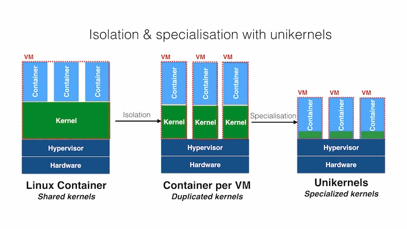
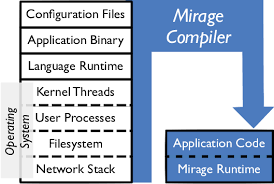
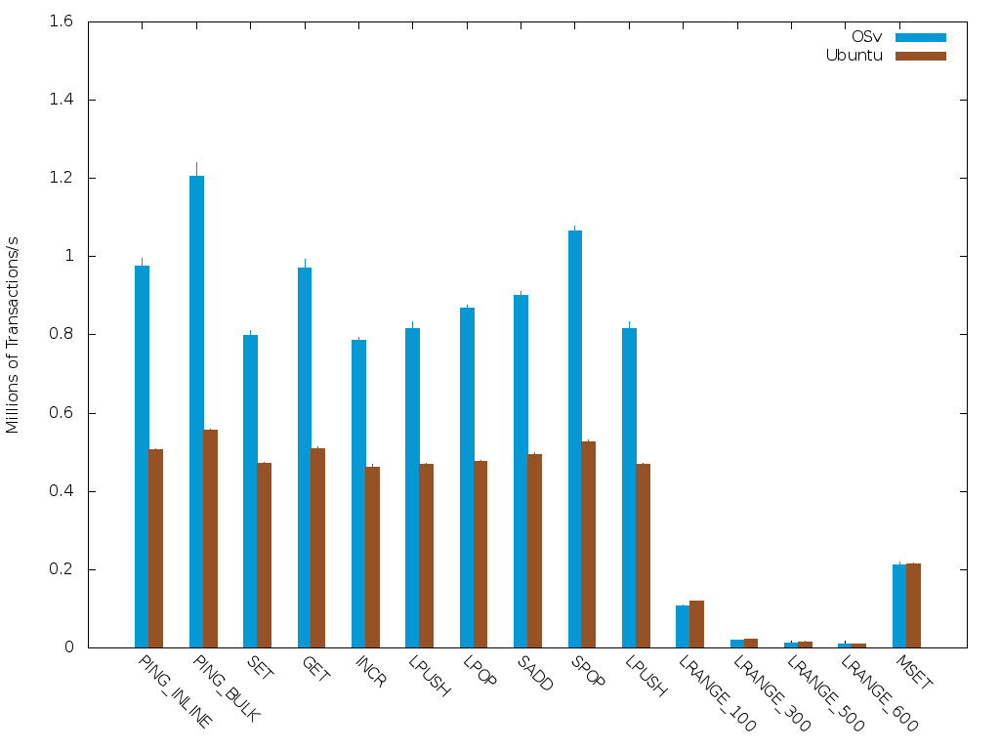
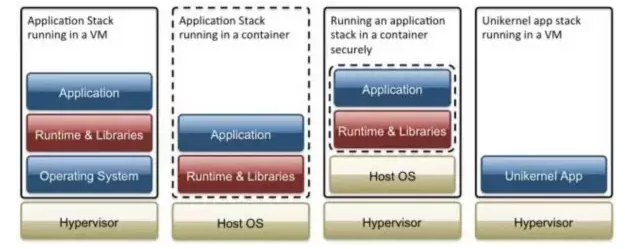
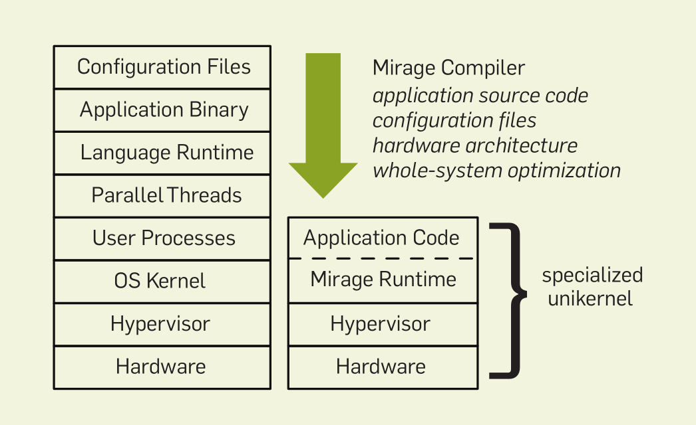
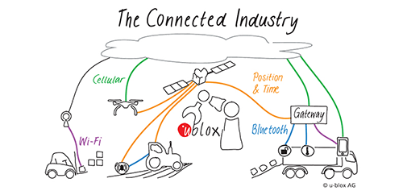
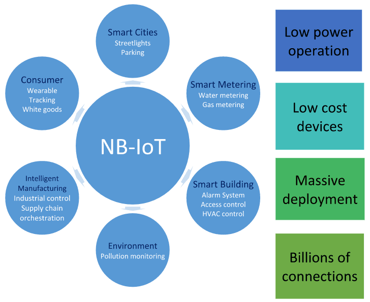
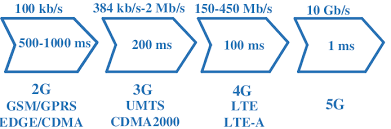

# includeOS on ARM 调研报告
- [includeOS on ARM 调研报告](#includeos-on-arm-%E8%B0%83%E7%A0%94%E6%8A%A5%E5%91%8A)
  - [项目简介](#%E9%A1%B9%E7%9B%AE%E7%AE%80%E4%BB%8B)
  - [项目背景](#%E9%A1%B9%E7%9B%AE%E8%83%8C%E6%99%AF)
    - [IoT](#iot)
    - [什么是Unikernel](#%E4%BB%80%E4%B9%88%E6%98%AFunikernel)
  - [立项依据](#%E7%AB%8B%E9%A1%B9%E4%BE%9D%E6%8D%AE)
    - [现有的 Unikernel 实现](#%E7%8E%B0%E6%9C%89%E7%9A%84-unikernel-%E5%AE%9E%E7%8E%B0)
      - [ClickOS](#clickos)
      - [Clive](#clive)
      - [DrawBridge](#drawbridge)
      - [HALVM](#halvm)
      - [includeOS](#includeos)
      - [LING](#ling)
      - [MirageOS](#mirageos)
      - [OSv](#osv)
      - [Rumprun](#rumprun)
      - [runtime-js](#runtime-js)
      - [UniK](#unik)
      - [HermitCore](#hermitcore)
    - [为什么选择 includeOS](#%E4%B8%BA%E4%BB%80%E4%B9%88%E9%80%89%E6%8B%A9-includeos)
  - [前瞻性分析](#%E5%89%8D%E7%9E%BB%E6%80%A7%E5%88%86%E6%9E%90)
  - [相关工作](#%E7%9B%B8%E5%85%B3%E5%B7%A5%E4%BD%9C)
    - [Ultibo](#ultibo)
      - [Ultibo的简介](#ultibo%E7%9A%84%E7%AE%80%E4%BB%8B)
      - [Ultibo的优点](#ultibo%E7%9A%84%E4%BC%98%E7%82%B9)
      - [Ultibo的缺点](#ultibo%E7%9A%84%E7%BC%BA%E7%82%B9)
    - [Raspbian](#raspbian)

## 项目简介

includeOS是一个 unikernel 的 C++ 实现，并可以在 bare-metal 上运行， includeOS 提供了丰富的用于网络编程的库，但是目前还不支持在 ARM 上运行。 includeOS 可以显著加快启动速度，并且减少进程切换等的无谓开销。现有的树莓派的 Unikernel 主要是对一些开关 GPIO 等相关的实现，但是对网络的支持很弱。在 IoT 领域中，有许多应用场景对延迟的要求十分苛刻，而本项目意在将 includeOS 移植到ARM上，这样对延迟敏感的 IoT 应用场景会有很大帮助。

## 项目背景

### IoT

IoT(Internet of Things)即物联网，它的定义为把所有物品通过射频识别等信息传感设备与互联网连接起来，实现智能化识别和管理。物联网通过智能感知、识别技术与普适计算、泛在网络的融合应用，被称为继计算机、互联网之后世界信息产业发展的第三次浪潮。物联网被视为互联网的应用拓展，应用创新是物联网发展的核心，以用户体验为核心的创新2.0是物联网发展的灵魂。自2009年8月温家宝总理提出“感知中国”以来,物联网被正式列为国家五大新兴战略性产业之一，写入“政府工作报告”，物联网在中国受到了全社会极大的关注。物联网有如下三个特征：

- 全面感知,即利用RFID,传感器,二维码等随时随地获取物体的信息。

- 可靠传递,通过各种电信网络与互联网的融合,将物体的信息**实时准确**地传递出去。

- 智能处理,利用云计算,模糊识别等各种智能计算技术,对海量的数据和信息进行分析和处理,对物体实施智能化的控制。

物联网将很多领域联系到了一起，使得很多不同的领域能够共享时间或者位置等数据。如果时间与位置不正确，或是因不可靠、高延迟、或不安全的系统建置而无法正常通讯，那么，物联网的许多很重要的功能或者优势便无法发挥效果。不准确的位置以及150微秒或更长的延迟，对消费装置和家庭网络或许可以被接受，但是对于工业应用，从效能、耐用度、安全性以及可靠度等方面来考虑，是不可接受的。

因此，物联网的发展需要更强的及时性，如何降低延迟，增强通信的实时性和准确性是工程师们一直在研究的重要课题。

### 什么是Unikernel

根据 kernel 的设计风格不同，操作系统可以被分成很多种类，比如 Linux 使用的是宏内核， Windows 使用的是混合内核。还有一种比较特别的内核类型叫做**外内核**(Exokernel)。传统的内核对硬件都做了抽象，避免应用程序直接访问硬件资源，只提供抽象层提供的接口，而外内核的不同之处在于它减少层次抽象并允许应用程序直接访问硬件和系统资源。用了Exokernel难道还要自己写各种硬件驱动，自己实现网络协议栈吗？为了避免使用 Exokernel 的开发人员自己手写各种硬件驱动等问题，一种可行的解决方案就是使用 **Library Operation System**。首先对硬件设备的驱动进行抽象，也就是定义一组接口，再针对不同硬件设备提供实现 library，在编译的时候，根据硬件配置引入合适的 library，应用和 library 一起构成了整个系统。例如，如果应用不需要持久磁盘的访问，那么设备驱动程序和 OS 有关磁盘使用的工具就可以不包含在生产 Image 中。这样做的优点如下：

- 减少了抽象层，可以直接操作硬件资源，操作系统可以具有更好的性能。
- 只包含应用和必要的 library，没用冗余，资源占用更少。

Unikernel 也就由此而来。
Unikernel 的官方解释是
> Unikernels are specialised, single-address-space machine images constructed by using library operating systems.
> 

即它是专用的，单地址空间的，使用 library OS 构建出来的镜像。

Unikernel 不仅可以运行在 bare-metal 上，也可以运行在虚拟机上。

### Unikernel 的优点

#### 充分发挥现代虚拟机技术的优势

##### 更高的运行性能

相比于Linux/Windows这种通用操作系统，Unikernel减少了复杂的软件抽象层。由于“内核”和应用程序没有隔离，运行在同一个地址空间中，消除了用户态和内核态转换以及数据复制的开销。最后，构建时可以采用全局优化技术，比如前面的MirageOS，可以进一步优化性能。

##### 更高的资源利用效率

传统的操作系统体积是非常大的，无论是 RedHat，SUSE 还是 Ubuntu 亦或是 Windows，他们的思路都是将操作系统做大做全。不论你需不需要，很多对于特定应用而言不必要的服务、驱动、依赖包等等都会包含在系统里。在启动时，也会加载尽可能全、多的库，这样很多硬盘空间、内存空间、CPU运行时间就被浪费了。即使通过一些手段和技术让传统操作系统瘦了下来（例如裁剪内核），仍然会有几十兆到几百兆的大小，这巨大的体积与云市场的“微服务”发展趋势是相悖的。Unikernel里只包含了程序真正依赖到的东西，无论镜像，还是启动后所占用的资源都非常小。比如 MirageOS 的示例 mirage-skeleton 编译出来的 Xen 虚拟机只有 2M。这样一来，即使每个 Unikernels 只运行一个微服务，资源利用效率依然很高。

##### 更好的隔离性和安全性

Unikernel 只运行操作系统的核心，甚至抛掉了那些可能是漏洞来源的视频、USB 驱动、系统进程等模块，极大的减小了潜在漏洞数量，相对攻击面就很小。并且，对于 Unikernel 而言，每一个操作系统都是定制用途的，其中包含的核心库均不相同，即使某个服务构建的操作系统由于特定软件问题而遭到入侵，同样的入侵手段在其他的服务中往往不能生效。这无疑增加了攻击者利用系统漏洞的成本。

##### 更强的可伸缩性

扩展的一个方法是运行更多的实例，而 Unikernel 包含的东西少，系统层初始化非常快，通常是几ms到十几ms，真正的时间会用在应用程序本身的启动上。这意味着 Unikernel 可以在负载增大时快速开启更多实例来均摊负载。在负载很低时，甚至可以在用户请求时才启动并对用户请求做出响应。

##### 更强的可迁移性

现代虚拟机技术通常需要支持热迁移。由于 Unikernel 镜像通常很小，迁移速度很快，不会带来网络压力。并且 Unikernel 有着极快的启动速度，这就让运行实例的实时迁移成为了可能。

#### 有效降低应用开发工作的复杂度

应用开发者可以完全使用高级语言进行开发工作，无需研究底层代码，也不用研究硬件协议。

但 Unikernel 也存在一些缺点，最大的缺点就是 Unikernel 是完全不可调试的，出现问题的解决方案只有重启或者重写。

## 立项依据

### 现有的 Unikernel 实现

http://unikernel.org/projects/

#### ClickOS

ClickOS 是基于开源虚拟化技术的高性能虚拟化软件平台。ClickOS 的虚拟机很小（5MB），可以快速启动（20ms），延迟很小（45us）。
ClickOS 的基础是 Mini-OS，Mini-OS 是使用 C 语言编写的，ClickOS 是使用 C++ 编写的，所以 ClickOS 开发者重新开发了 Mini-OS 的开发工具链，编写了一种 `Linux-independent C++ cross-compiler` 叫做 `newlibc`。

但是 ClickOS 不支持 ARM ，并且没有 Bare-metal 的支持，目前只支持虚拟机。

#### Clive 

用 Go 语言编写的在分布式和云计算环境中工作的操作系统，它的主要设计理念是：
- 云中没有软件堆栈。应用程序和服务与允许它们在裸硬件上运行的库一起编译。
- 系统接口是按照类似CSP的风格设计的。应用程序和组件通过通道进行通信，并且通道桥接到网络，管道和任何其他 I/O 工件。

Clive的裸机支持还在开发进行中，但开发不是非常活跃，基本已经停滞。

#### DrawBridge

DrawBridge 是一种新型虚拟化应用沙盒的研究原型。DrawBridge 结合了两种核心技术：第一种是 PicoProcess，它是一个基于进程的隔离容器，具有最小的内核 API surface;第二种是 library OS，它是一个可以在 PicoProcess 中高效运行的 Windows enlightened 版本。

在没有进行任何修改前提下，DrawBridge运行了许多现有的Windows应用程序，从桌面应用程序（如Microsoft Office 2010和Internet Explorer）到服务器应用程序（如IIS）。

通过一组 API 调用实现 picoprocess 中运行的代码和操作系统的通信和调用。这也意味着需要一个虚拟机监控程序和一个完证的操作系统来支持 DrawBridge。

*主要用于 Windows 程序的 Unikernel 化；没有计划要加入裸机的支持。*

#### HALVM

全称是 The Haskell Lightweight Virtual Machine。它是 Glasgow Haskell Compiler(GHC) 的一个移植，使开发人员能够编写可直接在 Xen 虚拟机管理程序上运行的高级、轻量 VMs。正如其名，突出特点是对 Haskell 语言支持非常好。为 HALVM 编写就想为普通的 Haskell 编写一样，许多纯净的 Haskell 库可以轻松地移植到HALVM上。

与典型的操作系统不同，HALVM 上的应用程序运行在一个非常低的层上，直接在 Xen 管理程序上运行。但这也意味着，*没有 Xen 管理程序就无法运行 HALVM, HAlVM 无法直接在裸机上运行*。

#### LING

项目开发不活跃， github 上距离上次项目更新已经过了4年。官网不再维护，wiki页面被撤除。

#### MirageOS

MirageOS 是一个用于构建服务于安全、高性能的网络应用 Unikernel 的**Library Opreating System**，适用于云计算领域，构建 web 服务，开创了 Unikernel 的先河。它将大型服务器划分为很多更小的虚拟机，使得服务器具有更强的拓展性和安全性。MirageOS 的最大优点之一是十分安全。虽然 MirageOS 也可以部署到嵌入式设备(如：树莓派)中，但仍然是基于底层虚拟化的实现(需要 kernel )，并不能在裸机上运行，这样会造成一定的资源浪费，还是存在提高效率的空间。

#### OSv

OSv 是一个专门为云虚拟机设计的新 OS, 能够在 1s 内启动。OSv 被设计为可以在任何 Hypervisor 之上执行单个应用程序，从而达到优秀的性能和方便的管理。

OSv 是针对云计算的，因此 ARM 支持作用有限。

#### Rumprun

Rumprun 基于 rump kernel, 支持运行未经修改的 POSIX 程序。Rumprun 支持 bare-metal, hypervisor 等多平台。

Rumprun 的缺陷有:

- 对于不适用单线程非虚拟化模型的应用程序，例如调用 fork() 和 execve() 的程序，支持不完善。

- 工具链必须支持交叉编译。

- 只支持 x86 平台。

#### runtime-js

runtime-js 基于 V8 JavaScript 引擎, 可以将 js 应用程序和 runtime, libOS 等捆绑成一个轻量化, 不可变的镜像进行发布和部署。

runtime-js 目前仍处于开发进程中，

#### UniK

UniK 是一种简化 unikernel 编译和编排的工具。与 Docker 构建和编排的方式类似，UniK自动将流行语言编译为 unikernel. UniK 将 unikernel 部署为OpenStack, VirtualBox, QEMU, AWS, vSphere, ukvm 和 Xen 上的虚拟机。UniK 整合了 Rumprun, OSv, IncludeOS 和 MirageOS 项目的工作。
 
UniK 可以通过 RESTful API 完全控制, 以实现和别的业务工具无缝集成。

但是，Unik 只是一个聚合平台，底层仍然需要 IncludeOS 等项目的支持。

#### HermitCore

HermitCore 是一个新颖的 unikernel 操作系统, 旨在给高性能计算和云服务提供可扩展可预测的 runtime 行为。当前已支持 C/C++, Fortran, Go, Pthreads, OpenMP, 以及 iRCCE 消息传递库。

HermitCore 主要针对高性能计算和云服务, 本项目中不予考虑。

#### includeOS

includeOS 也是一种 unikernel 的实现，它可以使应用在云端而无需安装操作系统，它的底层也是基于虚拟机的实现。includeOS 有如下优点：
- 性能优良，启动迅速，能在几十毫秒之内启动。
- 可移植性好，运行在虚拟机上。
- 安全性好，镜像中没有冗余代码。
- 体积小，只需很小的磁盘和内存。
- 支持在裸机上运行。
- 延迟很低。目前没有进程抢占，操作系统的行为非常静态，所以只要机器本身是可预测的，延迟也将是完全可预测的。因此，在裸机硬件上，IncludeOS可被视为低延迟，可预测的操作系统。具有实施应用程序优先级的抢占线程也正在开发中。
- 对网络的支持很好，与 Linux 相比表现出色。

includeOS 也有一些不完美之处：
- 缺少 ARM 支持。

但 includeOS 官方也正在开发对 ARM 的支持，计划中将在2020年上线。
我们最终选择 includeOS 的原因将在下文中阐述。

### 为什么选择 includeOS

我们选择 includeOS，出于以下原因：
- includeOS 使用 C++ 语言，符合团队知识背景。
- includeOS 拥有裸机支持。
- includeOS 开发正处于活跃状态。
- includeOS 可以为未来的 IoT 应用提供高性能和完善的网络支持。

其他的 Unikernel 实现有的不符合团队的知识背景，也有一些已经处于停止开发状态，没有技术支持，考虑到上述优点，我们最终选择了 includeOS。

## 前瞻性分析

### 延迟问题限制 IoT 的发展

物联网有很多领域对延迟和通信的可靠性具有很高的要求，延迟高或者通信不可靠都会造成比较严重的后果，会有工程师不希望的事情发生。

如果延迟和通信问题不能解决，很多概念将很难投入到真实的应用场景中。

例如：目前，车队已经可以利用电子记录装置(Electronic Logging Devices, ELD)来监控车辆的各种状态。重要的参数包括里程数、位置、停靠点、引擎使用、以及行车时数等。由于压力、燃料以及温度传感器已被整合到轮胎与引擎控制单元(Engine Control Units, ECU)中，可追踪如振动、湿度和排气量等参数，因此车辆的整体状况可以被实时监测，以便在发生严重故障前，提早进行维修。现在，主要的差别在于，需要结合精确定位与安全的及时数据通讯技术，来进一步监测车辆。

在农业领域方面，工业物联网有助于确保全球的食物供应。根据预测，到2050年，全球将有91亿人口，利用联网传感器来追踪温度、土壤条件、日照与湿度，能提供土地优化利用所需的数据。准确的位置服务与实时的信息通讯，能让农夫确保农作物在最佳的时刻快速、且有效地采收。

当然，如果延迟太高的话，以上真实场景中的应用落地就会用很高的难度。

### 延迟问题的由来

- 现在的 4G 网络延迟很高，并不是为 IoT 设备量身定制的，这造成 IoT 设备在很多场景下并不能真正应用。
- 现有的 Unikernel 对 bare-metal 的支持不够完善，无法在保证效率的同时具有很好的网络通信性能。

### 当前 IoT 的一些改进

#### 窄带物联网 NB-IoT（Narrow Band Internet of Things, NB-IoT）

基于蜂窝的窄带物联网(NB-IoT)成为万物互联网络的一个重要分支。

NB-IoT 构建于蜂窝网络，只消耗大约 180KHz 的带宽，可直接部署于 GSM 网络、UMTS 网络或 LTE 网络，以降低部署成本、实现平滑升级。

NB-IoT 有如下几个优点：

- 广覆盖
- 低功耗
- 低成本
- 大连接

#### 5G

5G 的一大特点就是极低的延迟。如下图： 

随着 5G 的逐渐普及，IoT 设备的延迟性会得到本质性的改善。

超可靠的低延迟通信(URLLC)是 5G 标准支持的几种不同类型的用例之一。

顾名思义，超低延迟和高可靠性是其核心特点。

使用 URLLC 技术，用户面上行时延目标是 0.5ms,下行也是 0.5ms。

#### RTOS

对于要求低延迟的应用场景，操作系统的实时性也是不可忽视的。

当前的 IoT 设备大多使用实时操作系统，如 FreeRTOS。

但 RTOS 还是一个操作系统，也就意味着它必然有进程调度等操作系统必然存在的延迟缺陷。

### includeOS 在这方面的优势

- 在 includeOS 移植到 ARM 之后，就可以在数量众多的 IoT 设备上运行。
- 在 IoT 设备上使用 includeOS，启动速度将明显加快。
- 基于 includeOS 良好的网络支持，IoT 可以获得更好的网络表现，网络延迟将显著降低。
- 与 RTOS 相比，includeOS 直接省去了操作系统，设备上也不会存在因为进程调度而产生延迟。
- 因为 includeOS 具有良好的安全性表现，物联网设备的安全性也会显著提高。

## 相关工作

### Ultibo

[Ultibo Website](https://ultibo.org/)

#### Ultibo的简介

Ultibo 是一个为 Raspberry Pi 上的嵌入式或者裸机开发的全功能环境。它并不是一个操作系统，但却可以提供许多与操作系统相同的服务，如内存管理，线程，网络和文件系统等。使用 Ultibo 提供通用的功能和服务，开发者无需从头开始开发工作。它可以使嵌入式应用程序的开发工作尽可能与其他平台的开发相似。开发者当然希望简单地使用 Ultibo 提供的 API 来开发连接设备的应用程序，或物联网（IoT）设备，Ultibo 支持 USB 和 TCP/IP 和 UDP 等标准协议或GPIO控制。Ultibo 也可以用来体验操作系统设计和嵌入式开发，避免从头开始创建所有环境，并允许开发者专注于在已经具有基本开发环境的情况下进行更多创新和尝试。

Ultibo 还可以用来作为核心探索特定的 ARM 技术，因为拥有完整而且不受限制的硬件访问，开发者可以直接控制 CPU 等硬件，需要时也可以使用 Ultibo 提供的网络连接和日志记录等服务。

Ultibo 使用 Pascal 语言实现，支持几乎所有的 Free Pascal RTL 功能，并且提供集成开发环境。

#### Ultibo的优点

- 已经可以在 ARM 架构下（如树莓派）运行。
- 有集成开发环境，以及社区支持。

#### Ultibo的缺点

- 对网络编程的支持弱，不适用于对延迟敏感的 IoT 设备。
- 和 C 和 C++ 语言相比，Pascal 不够简洁，不太适合用来构建系统。
- 现阶段使用 Pascal 构建的系统项目少。

### Raspbian

Raspbian 是一个基于 Debian 的专为树莓派设计的类 Unix 操作系统。它虽然不是树莓派官方编写的操作系统，但是从2015年起被树莓派官方基金会所支持。虽然它是现在树莓派上最流行的操作系统之一，但是也存在着很多缺点：
- 如果作为 IoT 设备的系统使用则冗余过多，硬件资源无法完全被利用，效率较低。
- 系统启动速度较慢。
- 系统对实时性的支持较差，无法用于对延迟敏感的 IoT 设备上。